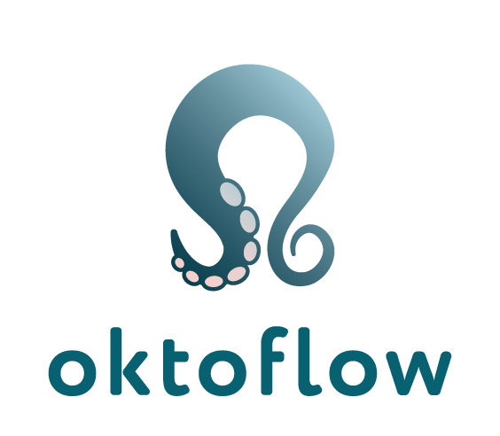

<table style="border:0px;">
 <tr style="border:0px;">
  <td style="border:0px;"></td>
  <td style="border:0px;"><h1>oktoflow/IIP-Ecosphere AI-enabled Industry 4.0/IIoT platform </h1></td>
  <td style="border:0px;"></td>
 </tr>
</table>

The virtual IIP-Ecosphere Industry 4.0/IIoT platform aims at demonstrating new approaches to vendor-independent, interoperable and open platform concepts for easy-to-use AI. In particular, it aims at uniform, distributed deployment of services to heterogeneous (edge) devices, an AI toolkit for the industrial production, consistent configuration support ranging from network to applications as well as the use and application of established and upcoming IIoT standards, e.g., asset administration shells (to be used for all platform interfaces).

## News

* New name: The IIP-Ecosphere platform becomes [oktoflow](https://oktoflow.de/).
* MIP technologies and NovoAI AVA connector definitions in configuration meta-model.
* Default library for code based on types or devices defined in the Platform configuration meta-model including code for controlling an MIP sensor.
* New application example: MIP connector and MIP AI improvement ping-pong
* Initial Beckhoff ADS integration library for Java.
* The [platform FAQ](platform/documentation/FAQ.MD) is now in github.
* Early snapshot of [upcoming platform handbook for version 0.6.0](platform/documentation/PlatformHandbook-0.6.0-SNAPSHOT-V0.1.pdf) now online in github (version as of 2023/09/14). Comments for clarification are welcome.
* Confirmed compatibility: Phoenix Contact PLCnext (OPC UA, EEM integration), Beckhoff IPC (OPC UA), VDW UMATI (OPC UA), Bitmotec (MQTT), Lenze (MQTT), MIP (MQTT), Beckhoff ADS (Windows) ...

## Public demonstrations

* Public demonstration on [EMO 2023](https://emo-hannover.de/) with magnetic identification by [MIP technology](https://mip-technology.de/de/), drive condition monitoring by [Lenze](https://lenze.de/) and AI-based visual quality inspection. 
* Public demonstrations on 2023/06/29 in [Hildesheim at the "day of computer science"](https://www.uni-hildesheim.de/fb4/veranstaltungen/tag-der-informatik/) as well as at [Nürnberg Digital "The future of intelligent Manufacturing"](https://nuernberg.digital/programm/details/die-zukunft-der-intelligenten-fertigung.html) on 2023/07/07. 
* Presentation of a federated learning case with two cobots on [HM'23](https://www.iip-ecosphere.de/iip-ecosphere-auf-der-hannover-messe-2023/) in collaboration with Phoenix Contact, Bitmotec/OnLogic, UR including platform-integrated federated learning based on [Flower](https://flower.dev/).
* Presentation of improved robot-based platform demonstrator at [TddT'22, Berlin](https://www.digitale-technologien.de/DT/Redaktion/DE/Veranstaltungen/2022/DT/220829_Tage_der_digitalen_Technologien.html) 
* Presentation of robot-based visual quality inspection app on [HM'22](https://www.hannovermesse.de/de/) (with 3 sources, Python-based AI, AAS-based Angular application).

## Overview

For detailed links to the individual components, please refer to the [platform](platform/README.md) overview. The platform repository also contains a growing set of [examples and demonstration use cases](platform/examples/README.md).

For more details on how to develop application-specific services for the IIP-Ecosphere platform, please watch our series of video tutorials on [YouTube](https://www.youtube.com/playlist?list=PL5VSYtiD_PfdxUDXGlX53UsHdQlXcHYK7) or [IIP-Ecosphere](https://www.iip-ecosphere.de/angebote/plattform/).

## Documentation

The platform concepts and realization are developed by the IIP-Ecosphere consortium and are documented in several whitepapers:
  * The IIP-Ecosphere [platform handbook version 0.6.0 preview](platform/documentation/PlatformHandbook-0.6.0-SNAPSHOT-V0.1.pdf) - in development, not formatted/reviewed.
  * The IIP-Ecosphere [platform handbook version 0.5.0](https://doi.org/10.5281/zenodo.7695124) [link may be updated some days after platform releases]
  * The IIP-Ecosphere [platform FAQ](platform/documentation/FAQ.MD).
  * Service development tutorial [YouTube](https://www.youtube.com/playlist?list=PL5VSYtiD_PfdxUDXGlX53UsHdQlXcHYK7) and [IIP-Ecosphere](https://www.iip-ecosphere.de/angebote/plattform/).
  * The IIP-Ecosphere [platform requirements (functional and quality view)](https://doi.org/10.5281/zenodo.4485774)
  * The IIP-Ecosphere [platform usage view](https://doi.org/10.5281/zenodo.4485801)
  * The IIP-Ecosphere [Industry 4.0 platform overview](https://doi.org/10.5281/zenodo.4485756)

All material is also available from the [IIP-Ecosphere Website](https://www.iip-ecosphere.eu/).

For detailed documentation and development hints see [documentation overview](platform/documentation/README.md). For a documentation of the releases of the IIP-Ecosphere platform see [releases overview](platform/documentation/RELEASES.md). For information on using/installing the platform, please consult the [installation overview](platform/documentation/INSTALL.md). 

## Publications
* Holger Eichelberger and Claudia Niederée, Asset Administration Shells, Configuration, Code
Generation: A power trio for Industry 4.0 Platforms, ETFA'23 (to appear in September 2023)
* Christian Sauer and Holger Eichelberger: Experiences in Collecting Requirements for an AI-enabled Industry 4.0 Platform, GI Fachgruppe Requirements Engineering (to appear in November 2023)
* Kevin Feichtinger, Kristof Meixner, Felix Rinker, István Koren, Holger Eichelberger, Tonja Heinemann, Jörg Holtmann, Marco Konersmann, Judith Michael, Eva-Maria Neumann, Jérôme Pfeiffer, Rick Rabiser, Matthias Riebisch and Klaus Schmid (2023): [Software in Cyberphysischen Produktionssystemen - Herausforderungen zur Umsetzung in der Industrie](https://ojs.di-verlag.de/index.php/atp_edition/article/view/2646) In: ATP-Magazin, 2023 (4): 62-68. 
* Holger Eichelberger, Gregory Palmer, Svenja Reimer, Tat Trong Vu, Hieu Do, Sofiane Laridi, Alexander Weber, Claudia Niederée, Thomas Hildebrandt in Thais Batista, Tomás Bures, Claudia Raibulet and Henry Muccini (Hrsg.) (2023): [Developing an AI-Enabled IIoT Platform - Lessons Learned from Early Use Case Validation](https://www.springerprofessional.de/developing-an-ai-enabled-iiot-platform-lessons-learned-from-earl/25802260) In: Software Architecture. ECSA 2022 Tracks and Workshops Bd. 13928. S. 265-283. Springer International Publishing.
* Holger Eichelberger, Gregory Palmer and Claudia Niederee (2023): Developing an AI-enabled Industry 4.0 platform - Performance experiences on deploying AI onto an industrial edge device In: Softwaretechnik-Trends, 43 (1): 35-37. 
* Christian Sauer and Holger Eichelberger (2023): Performance Evaluation of BaSyx based Asset Administration Shells for Industry 4.0 Applications In: Softwaretechnik-Trends, 43 (1): 47-49. 
* Ahmad Alamoush and Holger Eichelberger (2023): Adapting Kubernetes to IIoT and Industry 4.0 protocols - An initial performance analysis In: Softwaretechnik-Trends, 43 (1): 41-43. 
* Holger Eichelberger, Svenja Reimer, Claudia Niederée and Gregory Palmer (2022): [Virtuelle IIoT-Plattform für die Digitalisierung der Fertigung](https://www.degruyter.com/document/doi/10.1515/zwf-2022-1178/html) In: Zeitschrift für wirtschaftlichen Fabrikbetrieb, 117 (12): 884-887. 
* Kevin Feichtinger, Kristof Meixner, Felix Rinker, István Koren, Holger Eichelberger, Tonja Heinemann, Jörg Holtmann, Marco Konersmann, Judith Michael, Eva-Maria Neumann, Jérôme Pfeiffer, Rick Rabiser, Matthias Riebisch and Klaus Schmid (2022): [Industry Voices on Software Engineering Challenges in Cyber-Physical Production Systems Engineering](https://dl.acm.org/doi/abs/10.1109/ETFA52439.2022.9921568) In: 2022 27th IEEE International Conference on Emerging Technologies and Factory Automation (ETFA) S. 8. 27. International Conference on Emerging Technologies and Factory Automation, Stuttgart (Germany), IEEE.
* Holger Eichelberger, Heiko Stichweh and Christian Severin Sauer (2022): [Requirements for an AI-enabled Industry 4.0 Platform – Integrating Industrial and Scientific Views](https://www.thinkmind.org/index.php?view=article&articleid=softeng_2022_1_20_90004) In: SOFTENG 2022 The Eighth International Conference on Advances and Trends in Software Engineering S. 7-14. ThinkMind. 
* Claudia Niederée, Holger Eichelberger, Hans-Dieter Schmees, Alexander Broos and Per Schreiber Per, [KI in der Produktion – Quo vadis?](https://www.iip-ecosphere.de/wp-content/uploads/2021/11/IIP-Ecosphere-Whitepaper-zur-Umfrage-KI-in-der-Produktion.pdf), IIP-Ecosphere Whitepaper
* Miguel Gomez Casado and Holger Eichelberger (2021): Industry 4.0 Resource Monitoring - Experiences With Micrometer and Asset Administration Shells In: CEUR-WS Proceedings of Symposium on Software Performance 2021 (SSP'21) CEUR-WS.org.  
* Holger Eichelberger, Christian Sauer, Shayan Amir Ahmadian, Michael Schicktanz, Andreas Dewes, Gregory Palmer and Claudia Niederée, [IIP-Ecosphere Plattform – Anforderungen (Funktionale und Qualitäts-Sicht)](https://www.iip-ecosphere.eu/wp-content/uploads/2021/03/IIP-2021_002-eng.pdf), IIP-Ecosphere Whitepaper
* Heiko Stichweh, Christian Sauer and Holger Eichelberger, [IIP-Ecosphere Platform Requirements (Usage View)](https://www.iip-ecosphere.eu/wp-content/uploads/2021/03/IIP-2021_001_IIP-Ecosphere_Platform_Requirements_Usage_View.pdf), IIP-Ecosphere Whitepaper
* Christian Sauer, Holger Eichelberger, Amir Shayan Ahmadian, Andreas Dewes, Jan Jürjens, [Current Industrie 4.0 Platforms – An Overview](https://www.iip-ecosphere.eu/wp-content/uploads/2021/02/IIP-2020_001-en.pdf), IIP-Ecosphere Whitepaper

## Building the Platform

The platform consists of some core and many alternative components which can be built locally via the provided Maven multi-module POM. However, to save time, we recommend relying on the pre-built snapshot and release binaries in [Maven Central](https://search.maven.org/search?q=iip-ecosphere) from our Continuous Integration server. To speed up this process when changes to the individual modules occur, the build sequence is incremental and not based on the Maven multi-module build. So we recommend that you install Java, Maven and an IDE (supported/working versions see [documentation overview](platform/documentation/README.md)) and let Maven resolve the actual binaries for you. For more detailed information on the build dependencies, please refer to the platform handbook.

We've heard about strange problems on Mac OS. So far, we do not have enough information to resolve the potential problems.

To ease the first steps, we provided Demonstration and Development Docker Containers on [Docker Hub](https://hub.docker.com/r/iipecosphere/platform).

## Powered by (selection of used tools/frameworks)

 
 
 

 

 
 
 

IIP-Ecosphere would like to thank all utilized technologies and frameworks for the helpful contributions to the Open Source community.

