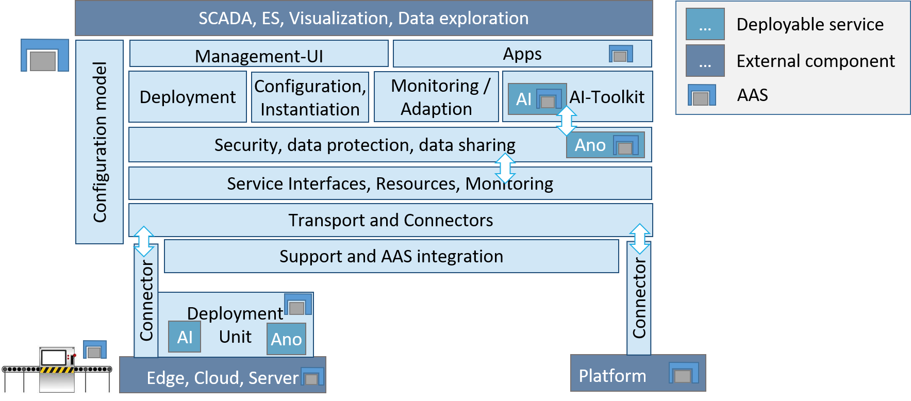

<table style="border:0px;">
 <tr style="border:0px;">
  <td style="border:0px;"></td>
  <td style="border:0px;"><h1>oktoflow/IIP-Ecosphere AI-enabled Industry 4.0/IIoT platform </h1></td>
  <td style="border:0px;"></td>
 </tr>
</table>

The oktoflow Industry 4.0/IIoT platform aims at demonstrating new approaches to vendor-independent, interoperable and open platform concepts for easy-to-use AI. In particular, it aims at uniform, distributed deployment of services to heterogeneous (edge) devices, an AI toolkit for the industrial production, consistent configuration support ranging from network to applications as well as the use and application of established and upcoming IIoT standards, e.g., asset administration shells (to be used for all platform interfaces).

For installation and first steps, see [install guide](platform/documentation/INSTALL.md).

## News

* ReGaP: Influx/Grafana based dashboarding for oktoflow apps, in integration with [Bitmotec](https://www.bitmotec.com/)
* For easing git checkouts: examples.hm22 and examples.emo23 have been moved to an own repository
* Upcoming support for Asset Administration Shells metamodel v3 through BaSyx2
* Support for Python 3.13 and virtual environments
* Automated container creation upgraded
* Mangement UI upgraded to Angular 19.
* Many interesting ideas and proto-requirements from the [ReGaP-community kickoff](https://regap.de/community-kickoff/). Initial contribution: file-based connector for CSV, JSON, etc.
* oktoflow code generation initially migrated to VTL artifacts, still improving/developing

## Public demonstrations

* Public demonstration on [EMO 2023](https://emo-hannover.de/) with magnetic identification by [MIP technology](https://mip-technology.de/de/), drive condition monitoring by [Lenze](https://lenze.de/) and AI-based visual quality inspection. 
* Public demonstrations on 2023/06/29 in [Hildesheim at the "day of computer science"](https://www.uni-hildesheim.de/fb4/veranstaltungen/tag-der-informatik/) as well as at [Nürnberg Digital "The future of intelligent Manufacturing"](https://nuernberg.digital/programm/details/die-zukunft-der-intelligenten-fertigung.html) on 2023/07/07. 
* Presentation of a federated learning case with two cobots on [HM'23](https://www.iip-ecosphere.de/iip-ecosphere-auf-der-hannover-messe-2023/) in collaboration with Phoenix Contact, Bitmotec/OnLogic, UR including platform-integrated federated learning based on [Flower](https://flower.dev/).
* Presentation of improved robot-based platform demonstrator at [TddT'22, Berlin](https://www.digitale-technologien.de/DT/Redaktion/DE/Veranstaltungen/2022/DT/220829_Tage_der_digitalen_Technologien.html) 
* Presentation of robot-based visual quality inspection app on [HM'22](https://www.hannovermesse.de/de/) (with 3 sources, Python-based AI, AAS-based Angular application).

The demonstrations and further experiments confirmed compatibility with Phoenix Contact PLCnext (OPC UA, EEM integration), Beckhoff IPC (OPC UA), VDW UMATI (OPC UA), Bitmotec (MQTT), Lenze (MQTT), MIP (MQTT), Beckhoff ADS (Windows), Phoenix Contact EEM-MA 370 (Modbus/TCP), Siemens SENTRON PAC 3200 (Modbus/TCP) ...

## Overview

For detailed links to the individual components, please refer to the [platform](platform/README.md) overview. The platform repository also contains a growing set of [examples and demonstration use cases](platform/examples/README.md).

For more details on how to develop application-specific services for the IIP-Ecosphere platform, please watch our series of video tutorials on [YouTube](https://www.youtube.com/playlist?list=PL5VSYtiD_PfdxUDXGlX53UsHdQlXcHYK7) or [IIP-Ecosphere](https://www.iip-ecosphere.de/angebote/plattform/).

## Documentation

Platform installation, use and concepts are documented in several documents:
  * The platform [installation guide](platform/documentation/INSTALL.md).
  * The platform [FAQ](platform/documentation/FAQ.md).
  * The platform [handbook](platform/documentation/PlatformHandbook.pdf) and on [Zenodo](https://doi.org/10.5281/zenodo.8429785)
  * The platform [releases overview](platform/documentation/RELEASES.md)
  * Service development tutorial [YouTube](https://www.youtube.com/playlist?list=PL5VSYtiD_PfdxUDXGlX53UsHdQlXcHYK7) and [IIP-Ecosphere](https://www.iip-ecosphere.de/angebote/plattform/).
  * The IIP-Ecosphere [platform requirements (functional and quality view)](https://doi.org/10.5281/zenodo.4485774)
  * The IIP-Ecosphere [platform usage view](https://doi.org/10.5281/zenodo.4485801)
  * The IIP-Ecosphere [Industry 4.0 platform overview](https://doi.org/10.5281/zenodo.4485756)
  * For more information, see the [documentation overview](platform/documentation/README.md)

## Publications
* Holger Eichelberger, Christian Sauer, Amir Shayan Ahmadian, Christian Kröher, Industry 4.0/IIoT Platforms for manufacturing systems - A systematic review contrasting the scientific and the industrial side, Journal of Information and Software Technology, 107650, 2024, [DOI](https://doi.org/10.1016/j.infsof.2024.107650)
* Christian Nikolajew, Holger Eichelberger, Industry 4.0 Connectors - A Performance Experiment with Modbus/TCP, Symposium on Software Performance (SSP'24), to appear, [arxiv](http://arxiv.org/abs/2410.15813)
* Alexander Weber, Jobst Hildebrand, Holger Eichelberger, ADS Performance Revisited, Symposium on Software Performance (SSP'24), to appear, [arxiv](http://arxiv.org/abs/2410.15853)
* Ahmad Alamoush, Holger Eichelberger, Open source container orchestration for Industry 4.0 - requirements and systematic feature analysis, International Journal on Software Tools for Technology Transfer, 26 (4) [DOI](https://doi.org/10.1007/s10009-024-00767-w)
* Holger Eichelberger, Alexander Weber, Model-Driven Realization of IDTA Submodel Specifications: The Good, the Bad, the Incompatible?, IEEE 28th International Conference on Emerging Technologies and Factory Automation (ETFA'24), pp. 1-8, [DOI](10.1109/ETFA61755.2024.10710924)
* Leonhard Faubel, Thomas Woudsma, Benjamin Kloepper, Holger Eichelberger, Fabian Buelow, Klaus Schmid, MLOps for Cyber-Physical Production Systems: Challenges and Solutions, IEEE Software, [DOI](https://doi.org/10.1109/MS.2024.3441101), [arxiv](https://arxiv.org/abs/2406.14470)
* Alexander Weber, Holger Eichelberger, Per Schreiber and Svenja Wienrich, Performance comparison of TwinCat ADS for Python and Java, [Symposium on Software Performance (SSP'23)](https://www.performance-symposium.org/2023/program/), 2023
* Ahmad Alamoush and Holger Eichelberger, Analyzing and Improving the Performance of Continuous Container Creation and Deployment, [Symposium on Software Performance (SSP'23)](https://www.performance-symposium.org/2023/program/), 2023
* Holger Eichelberger and Claudia Niederée, [Asset Administration Shells, Configuration, Code
Generation: A power trio for Industry 4.0 Platforms](https://ieeexplore.ieee.org/document/10275339), 
IEEE 28th International Conference on Emerging Technologies and Factory Automation (ETFA'23), pp. 1-8, [DOI](10.1109/ETFA54631.2023.10275339).
* Christian Sauer and Holger Eichelberger: Experiences in Collecting Requirements for an AI-enabled Industry 4.0 Platform, GI Fachgruppe Requirements Engineering, Softwaretechnik-Trends, 43(4), 2023 [GI](https://dl.gi.de/items/25db5e2c-c3c5-4f22-adae-f4829ad96e4a)
* Kevin Feichtinger, Kristof Meixner, Felix Rinker, Istvan Koren, Holger Eichelberger, Tonja Heinemann, Jörg Holtmann, Marco Konersmann, Judith Michael, Eva-Maria Neumann, Jerome Pfeiffer, Rick Rabiser, Matthias Riebisch and Klaus Schmid (2023): [Software in Cyberphysischen Produktionssystemen - Herausforderungen zur Umsetzung in der Industrie](https://ojs.di-verlag.de/index.php/atp_edition/article/view/2646) In: ATP-Magazin, 2023 (4): 62-68. 
* Holger Eichelberger, Gregory Palmer, Svenja Reimer, Tat Trong Vu, Hieu Do, Sofiane Laridi, Alexander Weber, Claudia Niederee, Thomas Hildebrandt in Thais Batista, Toms Bures, Claudia Raibulet and Henry Muccini (Hrsg.) (2023): [Developing an AI-Enabled IIoT Platform - Lessons Learned from Early Use Case Validation](https://www.springerprofessional.de/developing-an-ai-enabled-iiot-platform-lessons-learned-from-earl/25802260) In: Software Architecture. ECSA 2022 Tracks and Workshops Bd. 13928. S. 265-283. Springer International Publishing.
* Holger Eichelberger, Gregory Palmer and Claudia Niederee (2023): Developing an AI-enabled Industry 4.0 platform - Performance experiences on deploying AI onto an industrial edge device In: Softwaretechnik-Trends, 43 (1): 35-37. 
* Christian Sauer and Holger Eichelberger (2023): Performance Evaluation of BaSyx based Asset Administration Shells for Industry 4.0 Applications In: Softwaretechnik-Trends, 43 (1): 47-49. 
* Ahmad Alamoush and Holger Eichelberger (2023): Adapting Kubernetes to IIoT and Industry 4.0 protocols - An initial performance analysis In: Softwaretechnik-Trends, 43 (1): 41-43. 
* Holger Eichelberger, Svenja Reimer, Claudia Niederee and Gregory Palmer (2022): [Virtuelle IIoT-Plattform für die Digitalisierung der Fertigung](https://www.degruyter.com/document/doi/10.1515/zwf-2022-1178/html) In: Zeitschrift für wirtschaftlichen Fabrikbetrieb, 117 (12): 884-887. 
* Kevin Feichtinger, Kristof Meixner, Felix Rinker, Istvan Koren, Holger Eichelberger, Tonja Heinemann, Jörg Holtmann, Marco Konersmann, Judith Michael, Eva-Maria Neumann, Jerome Pfeiffer, Rick Rabiser, Matthias Riebisch and Klaus Schmid (2022): [Industry Voices on Software Engineering Challenges in Cyber-Physical Production Systems Engineering](https://dl.acm.org/doi/abs/10.1109/ETFA52439.2022.9921568) In: 2022 27th IEEE International Conference on Emerging Technologies and Factory Automation (ETFA) S. 8. 27. International Conference on Emerging Technologies and Factory Automation, Stuttgart (Germany), IEEE.
* Holger Eichelberger, Heiko Stichweh and Christian Severin Sauer (2022): [Requirements for an AI-enabled Industry 4.0 Platform - Integrating Industrial and Scientific Views](https://www.thinkmind.org/index.php?view=article&articleid=softeng_2022_1_20_90004) In: SOFTENG 2022 The Eighth International Conference on Advances and Trends in Software Engineering S. 7-14. ThinkMind. 
* Claudia Niederee, Holger Eichelberger, Hans-Dieter Schmees, Alexander Broos and Per Schreiber Per, [KI in der Produktion - Quo vadis?](https://www.iip-ecosphere.de/wp-content/uploads/2021/11/IIP-Ecosphere-Whitepaper-zur-Umfrage-KI-in-der-Produktion.pdf), IIP-Ecosphere Whitepaper
* Miguel Gomez Casado and Holger Eichelberger (2021): Industry 4.0 Resource Monitoring - Experiences With Micrometer and Asset Administration Shells In: CEUR-WS Proceedings of Symposium on Software Performance 2021 (SSP'21) CEUR-WS.org.  
* Holger Eichelberger, Christian Sauer, Shayan Amir Ahmadian, Michael Schicktanz, Andreas Dewes, Gregory Palmer and Claudia Niederée, [IIP-Ecosphere Plattform - Anforderungen (Funktionale und Qualitäts-Sicht)](https://www.iip-ecosphere.eu/wp-content/uploads/2021/03/IIP-2021_002-eng.pdf), IIP-Ecosphere Whitepaper
* Heiko Stichweh, Christian Sauer and Holger Eichelberger, [IIP-Ecosphere Platform Requirements (Usage View)](https://www.iip-ecosphere.eu/wp-content/uploads/2021/03/IIP-2021_001_IIP-Ecosphere_Platform_Requirements_Usage_View.pdf), IIP-Ecosphere Whitepaper
* Christian Sauer, Holger Eichelberger, Amir Shayan Ahmadian, Andreas Dewes, Jan Jürjens, [Current Industrie 4.0 Platforms – An Overview](https://www.iip-ecosphere.eu/wp-content/uploads/2021/02/IIP-2020_001-en.pdf), IIP-Ecosphere Whitepaper

## Tutorials (with oktoflow as example)

* Klaus Schmid, Holger Eichelberger, Variability Modeling and Implementation with EASy-Producer, International Software Product Line Conference (SPLC'24)
* Klaus Schmid, Holger Eichelberger, Modeling Variability and Its Transformation using the EASy-Producer tool suite, International Conference on Model Driven Engineering Languages and Systems (MODELS'24)
* Holger Eichelberger, Klaus Schmid, Modeling Asset Administration Shells in Industry 4.0 - A critical overview, International Conference on Model Driven Engineering Languages and Systems (MODELS'24)

## Contributing Student Works

* Monika Staciwa, AAS alternatives for Industry 4.0/IIoT platform oktoflow, MSc project thesis, 2025
* Christian Nikolajew, REST Konnektor für die oktoflow-Plattform, BSc thesis, 2024
* Kevin Schaperjahn, Python Code Artifakte für EASy-Producer / oktoflow, BSc project thesis, 2024
* Christian Nikolajew, Modbus TCP/IP Konnektor für die oktoflow-Plattform, BSc project thesis, 2024
* Jobst Hillebrandt, Implementierung, Evaluierung und Profiling einer Open Source JNI-Umsetzung für das TwinCat ADS-Protokoll, BSc project thesis, 2024
* Mara Rebecca Onesimiuc, Ansätze zur Identifikation und zum Enforcement von Architekturregeln für die IIP-Ecosphere Plattform, MSc thesis, 2024
* Jan-Hendrik Cepok, Evaluation und Verbesserung der IIP-Ecosphere-Konnektoren für OPC UA und Verwaltungsschalen, BSc thesis, 2024
* Marcel Nöhre, Swagger im Bereich IIP-Ecosphere für Verwaltungsschalen in der Industrie 4.0, BSc thesis, 2023
* Luca Schulz, Container-Virtualisierung mit LXC in der IIP-Ecosphere-Plattform, BSc thesis, 2023
* Marcel Nöhre, REST basierter Service als Anbindung an die Kodex-API im IIP-Ecosphere Projekt, BSc project thesis, 2022
* Luca Schulz, Analyse alternativer Realisierung des JSON-MQTT Datentransports in einer Industrie 4.0 im Rahmen von IIP-Ecosphere, BSc project thesis, 2022
* Monika Staciwa, Modell-basierte Erstellung von containervirtualisierter Industrie 4.0 Anwendungen am Beispiel der IIP-Ecosphere-Plattform, BSc thesis, 2022
* Miguel Gomez Casado, Service and device monitoring on devices in IIP-Ecosphere, BSc project thesis, 2021
* Monika Staciwa, Experimentelles Container-Deployment auf Industrie 4.0 Geräte, BSc project thesis, 2020

## Building the Platform

The platform consists of some core and many alternative components which can be built locally via the provided Maven multi-module POM. However, to save time, we recommend relying on the pre-built snapshot and release binaries in [Maven Central](https://search.maven.org/search?q=iip-ecosphere) from our Continuous Integration server. To speed up this process when changes to the individual modules occur, the build sequence is incremental and not based on the Maven multi-module build. So we recommend that you install Java, Maven and an IDE (supported/working versions see [documentation overview](platform/documentation/README.md)) and let Maven resolve the actual binaries for you. For more detailed information on the build dependencies, please refer to the platform handbook.

We've heard about strange problems on Mac OS. So far, we do not have enough information to resolve the potential problems.

To ease the first steps, we provided Demonstration and Development Docker Containers on [Docker Hub](https://hub.docker.com/r/iipecosphere/platform).

Please note that several python models exceed the permitted file size of github, thus, [GIT Large File Support](https://git-lfs.com/) is required.

## Powered by (selection of used tools/frameworks)

 
 
 

 

 
 

 

IIP-Ecosphere would like to thank all utilized technologies and frameworks for the helpful contributions to the Open Source community.

