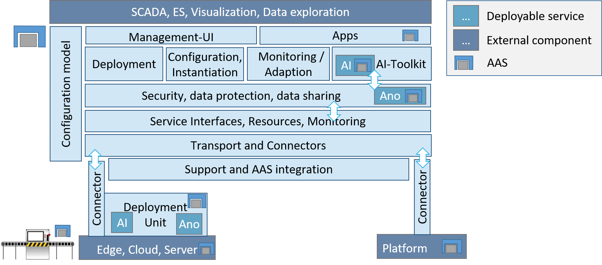
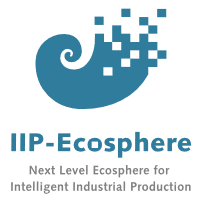

# IIP-Ecosphere platform 

The virtual IIP-Ecosphere Industry 4.0/IIoT platform aims at demonstrating new approaches to vendor-independent, interoperable and open platform concepts. In particular, it aims at uniform, distributed deployment of services to heterogeneous (edge) devices, an AI toolkit for the industrial production, consistent configuration support ranging from network to applications as well as the use and application of established and upcoming IIoT standards, e.g., asset administration shells (to be used for all platform interfaces).

The platform concepts and realization are developed by the IIP-Ecosphere consortium and are documented in several whitepapers:
  * The IIP-Ecosphere [Industry 4.0 platform overview](https://doi.org/10.5281/zenodo.4485756)
  * The IIP-Ecosphere [platform usage view](https://doi.org/10.5281/zenodo.448580)
  * The IIP-Ecosphere [platform requirements(functional and quality view)](https://doi.org/10.5281/zenodo.4485774)
  * The IIP-Ecosphere [platform handbook](https://doi.org/10.5281/zenodo.5168946) [link may be updated some days after code releases]

All material is also available from the [IIP-Ecosphere Website](https://www.iip-ecosphere.eu/).

## Documentation and release overview

For detailed documentation and development hints see [documentation overview](https://github.com/iip-ecosphere/platform/tree/main/platform/documentation/README.md). For a documentation of the releases of the IIP-Ecosphere platform see [releases overview](https://github.com/iip-ecosphere/platform/tree/main/platform/documentation/RELEASES.md).

## Available components

The following layers and components of the IIP-Ecosphere are available in this platform:
* Managed [Platform dependencies](https://github.com/iip-ecosphere/platform/tree/main/platform/platformDependencies/README.md) (parent POM)
* [Support Layer](https://github.com/iip-ecosphere/platform/tree/main/platform/support/README.md) (with links to contained parts)
    * [Asset Administration Shell (AAS) abstraction](https://github.com/iip-ecosphere/platform/tree/main/platform/support.aas.basyx/README.md) with Visitor, communication protocol support and useful recipes for deployment and I/O
    * [Default Basyx AAS client abstraction](https://github.com/iip-ecosphere/platform/tree/main/platform/support.aas.basxy/README.md) implementation for [Eclipse Basyx](https://www.eclipse.org/basyx/)
    * [Default Basyx AAS server abstraction](https://github.com/iip-ecosphere/platform/tree/main/platform/support.aas.basxy/README.md) implementation for [Eclipse Basyx](https://www.eclipse.org/basyx/)
    * [AAS support](https://github.com/iip-ecosphere/platform/tree/main/platform/support.iip-aas/README.md) functionality for the IIP-Ecosphere platform
* Transport Layer
    * [Transport component](https://github.com/iip-ecosphere/platform/tree/main/platform/transport/README.md) (with links to contained parts)
         * Transport connector for MQTT v3 and v5 based on [Eclipse Paho](https://www.eclipse.org/paho/)
         * Transport connector for AMQP based on [RabbitMQ](https://www.rabbitmq.com/)
    * Optional [transport support](https://github.com/iip-ecosphere/platform/tree/main/platform/transport/README.md) for [Spring cloud stream](https://spring.io/projects/spring-cloud-stream) (with links to contained parts)
         * Transport connector binder for MQTT v3 and v5 based on [Eclipse Paho](https://www.eclipse.org/paho/)
         * Transport connector binder for AMQP based on [RabbitMQ](https://www.rabbitmq.com/)
    * Platform/Machine [connectors component](https://github.com/iip-ecosphere/platform/tree/main/platform/connectors/README.md) (with links to contained parts)
       * Platform connector for OPC UA v1 based on [Eclipse Milo](https://projects.eclipse.org/projects/iot.milo)
       * Platform connector for AAS based on the abstraction in the support layer
       * Platform connector for MQTT v3 and v5 based on [Eclipse Paho](https://www.eclipse.org/paho/)
 * [Services](https://github.com/iip-ecosphere/platform/tree/main/platform/services/README.md) 
    * Basic platform [service management](https://github.com/iip-ecosphere/platform/tree/main/platform/services/services/README.md) 
    * Default [service management](https://github.com/iip-ecosphere/platform/tree/main/platform/services/services.spring/README.md) for Spring Cloud Streams
    * Multi-language [service execution environment](https://github.com/iip-ecosphere/platform/tree/main/platform/services/services.execution/README.md) for Java and Python (connected through protocols of the Support Layer)
 * [Resource management](https://github.com/iip-ecosphere/platform/tree/main/platform/resources/README.md) and Monitoring
    * [Edge Cloud Server (ECS) runtime](https://github.com/iip-ecosphere/platform/tree/main/platform/resources/ecsRuntime/README.md)
    * Default resource management for [Docker](https://github.com/iip-ecosphere/platform/tree/main/platform/resources/ecsRuntime.docker/README.md)
   * Upcoming: Resource management for Kubernetes
 * [Security and Data Protection] (https://github.com/iip-ecosphere/platform/tree/main/platform/securityDataProtection/README.md)
 * Reusable Intelligent Services
 * Configuration
    * IVML platform [configuration](https://github.com/iip-ecosphere/platform/tree/main/platform/configuration/configuration/README.md)
    * resource optimization
    * adaptation

Released components are made available via [Maven Central](https://search.maven.org/search?q=iip-ecosphere).

