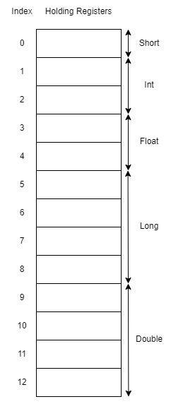

# Connectors Component MODBUS/TCP extension in the Transport Layer of the oktoflow platform

MODBUS/TCP machine connector for bi-directional access to devices and machines and already installed platforms based on [Jamod](https://jamod.sourceforge.net/). It can be loaded as plugin or used as JSL component (direct dependency, e.g. for testing). 

We run the tests without AAS factory installed in order to simplify the test. 

The tests are based on the MODBUS data model below:
