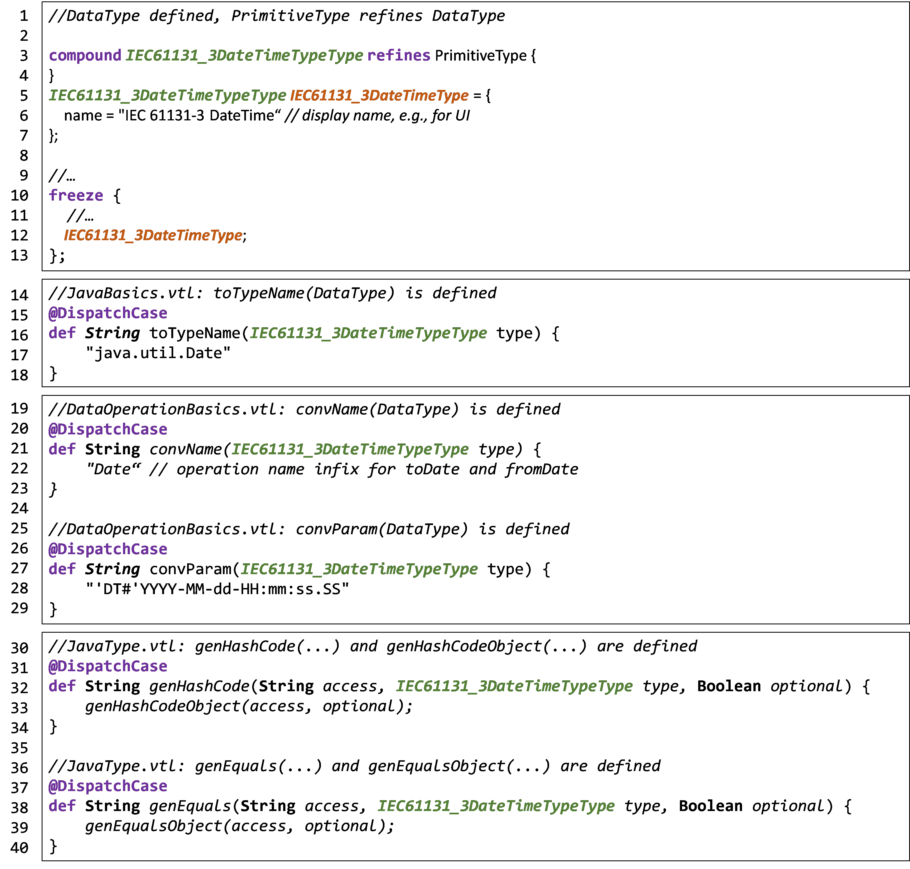
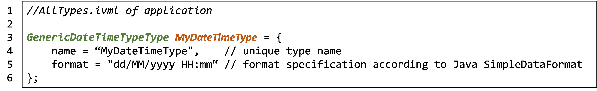
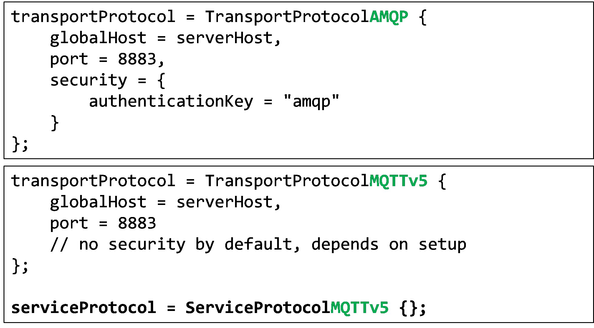
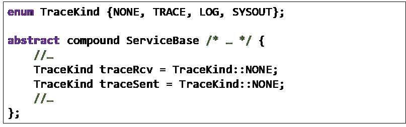

# oktoflow How-To

In this section, we summarize procedures for some tasks that you may want to perform with the oktoflow platform.

## Defining an own application-specific service

1. Adjust your platform configuration and define a new service.
2. Execute the platform instantiation with `configuration:generateAppsNoDeps` so that the service interfaces artifact is generated and installed.
3. Import the generated template (`gen/templates`) as project into Eclipse and add only required components as dependencies, in particular your configured application interfaces (see step 1). Alternative and optional components such as AAS implementations or protocols may be added as dependencies in the test scope.
4. Realize the service, e.g., as Java class(es) in src/main/java or Python class(es) in src/main/python/services implementing the new interface(s).
    1. **Java:** For automated creation of instances, services must have two constructors, one taking the serviceId and an InputStream containing the deployment descriptor YAML as well as a no-argument fallback constructor.
    2. **Python:** The service must be a class implementing the generated base service, which carries the service identification, description, etc. At the end of your class, the service must instantiate itself to register with the service environment. Further, a Maven artifact descriptor is required to correctly package and deploy the Python sources.

For all supported programming languages, we recommend using the generated application templates, which contain programming frames for Java and Python services, frames for Java and Python tests, testing resources, an example identity store file, required packaging descriptors, and a matching build process.

1. Modify the platform configuration by adding the artifact specification of your service implementation artifact to the configuration of your service(s).
2. Run the platform instantiation with generateApps so that the complete artifact is built.
3. Deploy the artifacts to your installation devices, start the platform and try out your service.
4. Let is know about your work. In case of a potential open source component, please consider contributing it to the platform.

## Defining an AAS for a device

Nowadays, AAS is still a rather new approach and devices may not be equipped with their own AAS, although first experimental device plugins do exist, e.g., for Phoenix Contact PLCnext. Currently, the platform allows for two ways of defining an own AAS, in particular to provide a nameplate with device/vendor information or, if desired, a specification of the provided device services.

1. The first approach is to pragmatically state the AAS in a specific Yaml-Format, which is turned into an AAS.
2. The second approach is to provide an AASX package, which makes up the device AAS.

Further forms, e.g., referring to an external AAS, can be realized through plugins. The AAS specification can be:

1. Build into your instantiated platform if the respective files are stated in the resources/device folder before starting the platform instantiation. These files are named according to the device identification, e.g., by default the MAC-Address with all characters in capitals.
2. Loaded from the device upon startup of the respective ECS runtime. Thereby, we search for a file called nameplate.yml or device.aasx in the installation folder of the platform component, respectively.

The AAS must at least contain a nameplate.

## Implementing a monitoring/alert data service

Monitoring services are data- or application-specific Java functions that may send out an alert if specific conditions occur. So far, the platform does not implement a generic, e.g., rule-based alert service that can easily be reused. Basically, a monitoring/alert data service is realized as discussed for general application-specific services. However, to have access to the micrometer monitoring structures, specific steps may be required in Step 4:

Realize the service, e.g., as Java class(es) implementing the new interface(s) and the MonitoringService interface from services.environment. This will provide a service with access to the `MetricsProvider` in case that you want to add custom metrics. Consider `Transport.sentAlert` if conditions fail. In addition, the interface `UpdatingMonitoringService` is automatically called regularly to update metrics if needed. As above, please consider the rules for constructors.

## Extending the platform by adding a component or a platform service

1. Make yourself familiar with the design of the respective component. Identify the interfaces to implement, e.g., the Service interface in services.environment.
2. Create a Maven Eclipse project, use the platform dependencies as parent and add only required components as dependencies. Alternative and optional components such as AAS implementations or protocols may be added as dependencies in the test scope, not in the (default) production scope.
3. Implement your component and test it.
4. Consider extending the platform configuration meta-model, i.e., search for the part describing the components. In some cases, e.g., AAS protocols, this may just be an additional entry in an enumeration. For other components, this may require a new typed IVML compound with default values (akin to the already given compounds). For services, no changes to the meta-model are required.
5. Adjust your platform configuration so that your new elements are taken up. In case of a new enum value, use that value. In case of a new compound, replace the existing compound value by a value of your type (providing also the respective settings in the compound value). For a new service, add the service to the application part of your platform configuration and link it into the service mesh.
6. Run the platform instantiation, copy the artifacts to your installation devices, start the platform and try out your extension.
7. Let us know about your work. In case of a potential open source component, please consider contributing it to the platform.

## Defining a new type in the configuration model

The platform configuration model is equipped with several basic types, e.g., for String, Integer numbers, IEC61131-3 date type or OPC UA basic types. However, we do not aim at defining an encompassing set of types rather than mechanisms that allow for adding types later. This is in particular true for record types, which may be highly application specific. This is also true for primitive types. The definition of primitives applies the IVML model pattern for alternatives with detailing properties.

To add a new primitive type, we explain the modifications to the configuration model for the IEC61131-3 date-time type as illustrated below:

1. Define a new meta-type for the type, i.e., a compound that just refines the respective base meta type, e.g., `PrimitiveType` or `ArrayType` (lines 3-4, thus suffix `TypeType`).
2. Define a variable of that type and assign a default (display) name (lines 5-7). This variable will represent the type, e.g., in record fields and, thus, the variable has the name suffix Type. The name will be used by the code generation as fallback alternative in several situations if the behavior is not overridden.
3. Freeze the new variable in order to make it available to the code generation as it is (lines 19-13).
4. Adjust the intentionally open parts of the code generation. For example, we extend the language basics for the generation of Java artifacts (lines 16-18) by a specific method which returns the type name to be used (a basic method for `DataType` is defined, the new method is selected through dynamic type dispatch). Similar, the method in lines 21-23 indicates that a type-specific conversion parameter shall be used when obtaining values from a connector parser or writing values to a connector formatter.
5. Adjust also the code generation for Python in `PythonBasics.vtl` (similar to step 4).

The may create the impression that all foundational parts of the model must be modified to introduce new data types. While this is true for default types that shall be shipped with the platform, it is not necessarily true for data types needed by individual applications. Thanks to the dynamic dispatch across imported IVML/VTL modules, it is possible to define the type and the overridden functions also in their own platform configuration module, which imports the shipped platform model.

However, it is important that also certain consistency rules apply. The types declared in `JavaBasics.vtl` and the names/conversion parameters declared in `DataOperationBasics.vtl` must match the underlying implementation, in particular of the `InputConverter` and `OutputFormatter` interfaces declared in the Connectors Component. There, the specified Java types must be valid input/output parameters of operations with name infix declared in the corresponding convName function. For the used Java types, the assumption is that types declared in the Java library or in the imported components can be used. Other types must be converted by the connector or service targeted by the code generation. Moreover, if a conversion parameter is required, e.g., for date or time values, also the value provided by the convParam function must match. For date/time conversion parameters, formatter strings as valid for the Java `SimpleDateFormat` class or logical names as defined in the FormatCache class of the connectors component may be used, e.g., ISO8601 for a specific date format not supported by `SimpleDateFormat`. Further additions to `JavaType.vtl` may be required if the type is declared as primitive type and realized in Java as object. Then the approaches to obtain a hashcode (lines 31-34) and an equals comparison (lines 37-40) have to be adjusted from Java primitive types to object types.

Besides well known date types like IEC61131-3 that shall be part of the configuration meta-model, there are also plenty types that have been defined due to specific or local needs. Applying the modifications discussed above for all such types does not scale. Thus, the platform configuration meta model defines a GenericDateTimeTypeType that is already set up in the way described above, but allows for specifying a date format (based on the conventions of Javas `SimpleDateFormat`. In the type definitions of an application, one can now define own time formats as illustrated below. Please note that such a type definition is application-local, potentially local to a platform instance and not supplied by the platform as the `IEC61131_3DateTimeType`.

## Using a different transport protocol

The default transport protocol that is being set up and integrated by the platform integration is AMQP. The following describes what steps are needed to use one of the alternatives, e.g., MQTT v5.

1. Open your configuration for editing
2. Search for the variable `transportProtocol` and replace in the instance type the suffix AMQP by MQTTv5 (or MQTTv3, respectively). AMQP requires an authentication which is obtained from the identity store using the key "amqp". In contrast, MQTT does not require an authentication (which may differ depending on your setup). The values for `globalHost`, the global communication broker (by default "localhost", which may be explicitly set to globalhost) may be adjusted as needed.
3. Add the `serviceProtocol` assignment (last line of the lower box in the figure below), which is so far set to AMQP by default in the shipped models.
4. Re-run the instantiation of your platform to enact the changes.

The platform may instantiate an example broker for the selected protocol using generateBroker on as argument for the `PlatformInstantiator`. Please consider that different combinations of brokers and protocol implementations may imply different timing behaviour, e.g., when an operation shall be considered as failed due to timeouts. For this purpose, the transport protocol defines the actionTimeout setting, a timeout in milliseconds when an operation is considered as failed. By default and experience, a sufficient timeout for AMQP is 1000 ms and for MQTT 3000 ms (considered automatically as minimum values during platform/application instantiation).

## Observe or debug the data processing

To figure out what is happening in the data processing in a service mesh, of course you can add respective logging calls to the code that implements your services. Please consider that depending on the approach such additional calls may impact the performance (throughput), i.e., approaches to at least disable the logging (as usually supported by logging frameworks) shall be applied. In addition, the platform currently offers two further approaches that are generated into the service glue code that is calling your code and, thus, also applies to connectors and services that are not realized by your organization: Logging and tracing.

- _Logging_ emits information via the default logging framework used in the platform as debug information to the respective log output (as set up the console, a file, etc.).
- _Command line streams_ (sysout) logging is like logging via a framework, but emits the information without filtering (and specific logging formatting). This may be helpful if it is inconvenient to change the logging level of the logging framework or other software takes control over filtering of the logs and prevents debug output.
- _Tracing_ means sending trace entries through the trace channel to any interested party, in particular the hybrid `TraceToAasService`. The `TraceToAasService` may act as a sink in a service mesh and turns in particular received trace entries into an AAS structure. That service can be used as it is (generic service) or customized by code to allow, e.g., for application-specific operations.

All services in the configuration model offer individual tracing settings as declared in the Services module of the configuration model as illustrated below.

Currently, there are four modes, no tracing (`NONE`) as well as tracing (`TRACE`) and logging as debug information via the logging framework (`LOG`) and logging on the system output stream (`SYSOUT`). These modes can be set for data reception (`traceRcv`) and data sending (`traceSent`) of a service. If enabled, respective code is inserted during code generation. By default, tracing is disabled on all services, but you may activate it individually, e.g., to focus debugging on a certain part of a service mesh.

In some cases, knowledge on the input / output of services may be sufficient to identify a problem. In some cases, the problem is part of the routing of the data among the services. For this purpose, the application allows to set a debug flag (Boolean debug = false), which may enable additional logging and debugging methods of the service execution framework, e.g., for Spring Cloud Stream.

Enabling debugging requires a re-instantiation of the application. Usually, the application rather than its interfaces is sufficient, i.e., generateApps rather than generateAppsNoDeps would be the required option for the `PlatformInstantiator`.