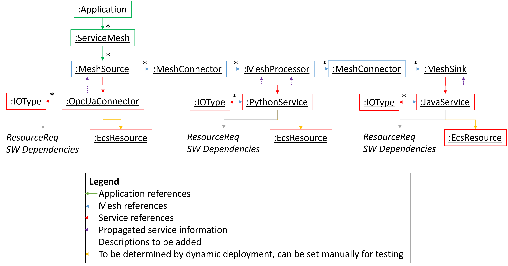

# oktoflow app configuration: Apps and Service Meshes

Applications running on the oktoflow platform consist of connectors and services. The data flow among them is specified in terms of service meshes, i.e., mesh/graph elements like (data) sources, (data) processors and (data) receivers. For example, if the data flow originates at a machine, the corresponding data source is typically implemented by a connector. If the data is passed through a service for processing and data modification, e.g., an AI service, the corresponding mesh element is a data processor implemented by a service. Finally, the point where the data ends is a data receiver, implemented, e.g., by a handover to Grafana through a (reverse) connector or a generic TraceToAAS service.



In an app configuration, `MeshSource` (data source), `MeshProcessor` (processor) and `MeshSink` (receiver) are connected as nodes (refining `MeshElement`) in a service mesh. Each node references the underlying implementing service/connector, allowing the same service to be used in multiple service meshes or multiple times in the same service mesh. Data flows among service mesh elements are specified as `MeshConnector`. An application specifies its constituting service meshes (usually one) as well as technical information.

The tables summarize all configurable fields for mesh and application types. For details and background on the types and their relations see the [platform handbook](../PlatformHandbook.pdf), e.g., how values from servics are pulled during configuration validation into `MeshElement` instances to ensure a consistent configuration.

Usually, applications run in distributed manner. Manually starting apps and their services is possible (through the platform CLI), but tedious. [Deployment plans](deploymentPlans.MD) allow for specifying the startup "program" of an app with respect to existing resources.

## Application

Fields of the 'Application' type.

| Field |  Description | Default |
| --- |  --- | --- |
| ver | The version of the application. |     |
| snapshot | Is this application a release or a snapshot. |     |
| id  | Unique id used for managing the application. |     |
| name |  Descriptive name used to derive class names from. |     |
| artifact |  Maven artifact coordinate containing the (generated) application implementation. |     |
| services | References to constituting service meshes. |     |
| nameplateInfo | Nameplate information denoting the application creator / vendor. |     |
| createContainer |  Shall containers be created for this application. | false |
| debug | Shall debug output be included into the generated application code. | false |
| withDocs | Shall the application be build with documentation (may affect code templates only, may take more time). | `false` |
| allTypes | Build the application with all types, not just the used/specified (may affect code templates only, may take more time). | `false` |
| allServices | Build the application with all services, not just the used/specified (may affect code templates only, may take more time). | `false` |
| buildIncremental | Build the application in incremental mode, not completely after deleting (may affect code templates only, may take less time). | `false` |
| cmdArg |  Command line arguments to be passed to the application on startup. |     |
| servers |  References to servers belonging to this application. Servers must also be referenced by services requiring individual servers. | `{}` |
| packaging | Packaging scheme, see [platform handbook](../PlatformHandbook.pdf) Section 3.5.3 | `AppPackagingSchema::SpringFat` |
| displayRows | Sequence of references to [DisplayRow instances](types.MD) to indicate the dashboard display rows that belong to this application | `{}` |
| typeSubstitutions | Substitutes given input/output types by refined input/output types, specified in terms of `TypeSubstitution` instances, see [app templates](appTemplates.MD) for details. | {} |
| identityStore | Optional application identity store, see [app templates](appTemplates.MD) for details. | `null` |
| derivedFrom | Name of the app template this application is derived from, just as information | `null` |

## ServiceMesh

Fields of the 'ServiceMesh' type.

| Field |  Description | Default |
| --- | --- |  --- |
| description |  Description of the mesh. |     |
| sources |  References to all mesh data sources. |     |

## Mesh nodes

'MeshElement' is the basic type for all nodes in a service mesh.

| Field | Description | Default |
| --- |  --- | --- |
| name |  Descriptive name of the mesh element. |     |
| kind |  Kind of element, e.g., source, transformer |     |
| impl |  Reference to implementing service. |     |
| ensemble |  References to mesh elements that shall be started by default in the same process. Can be overridden by deployment plan. | null |
| pos_x |  Graphical position in UI editor. | \-1 |
| pos_y |  Graphical position in UI editor. |     |

'MeshSource' is a refined 'MeshElement' stating the point of data ingestion for forward flows.

| Field |  Description | Default |
| --- |  --- | --- |
| next |  Outgoing `MeshConnector` instances |     |
| pollInterval |  If the implementing service supports polling, at which period in milliseconds shall the polling take place. | 1000 |
| output |  Outgoing data types. _Do not fill, pulled from implementing service by propagation._ | _pulled!_ |

'MeshSource' is a refined 'MeshElement' characterizing all non-source (inner) elements.

| Field |  Description | Default |
| --- |  --- | --- |
| next | Outgoing `MeshConnector` instances |     |

'MeshProcessor' is a refined 'MeshInnerElement' characterizing a data processor within a data flow.

| Field |  Description | Default |
| --- |  --- | --- |
| input | Incoming data types. _Do not fill, pulled from implementing service by propagation._ | _pulled!_ |
| output | Outgoing data types. _Do not fill, pulled from implementing service by propagation._ | _pulled!_ |

'MeshSink' is a refined 'MeshInnerElement' characterizing where a data flow ends.

| Field | Description | Default |
| --- | --- | --- |
| input | Incoming data types. _Do not fill, pulled from implementing service by propagation._ | _pulled!_ |

## Mesh connectors

| Field |  Description | Default |
| --- |  --- | --- |
| name |  The descriptive name of the connector. |     |
| next |  The mesh element the connector is connecting to. |     |

## Sub-mesh

A sub-mesh represents a partial re-usable mesh, which actually is a service refines (`ServiceBase`) and allows specifying a mesh, which is substituted wherever the sub-mesh is used in a service-mesh. 

A sub-mesh has all fields of `ServiceBase` as well as the following fields:

| Field |  Description | Default |
| --- |  --- | --- |
| sources |  `MeshConnector` instances pointing to the source mesh elements of this sub-mesh. |     |
| pseudoSink | A single sink where outgoing flows connect to. Will be virtually substituted by the outgoing mesh connectors of the referring `MeshElement`. |     |

## An example of Application IVML file

An application IVML configuration file from Asynchronous Python example in Oktoflow platform

```
project ApplicationPartPythonApp {

    import ServiceMeshPartPythonApp*;

    annotate BindingTime bindingTime = BindingTime::compile to .;
    
    Application myPythonApp = {
        id = "PythonApp",
        name = "Simple Python demo flow app",
        ver = "0.1.0",
        description = "",
        services = {refBy(myPythonMesh)}        
    };
    
    freeze {
        .;
    }

}
```

The `ApplicationPartPythonApp` is an application IVML configuration file that is part of the Oktoflow platform examples: [Asynchronous Python](../../examples/examples.python). It imports the `ServiceMeshPartPythonApp*` from the same example, which includes the 'ServiceMesh' for the application. It defines the ID, name, version, description, and 'ServiceMesh' for the application.

## An example of ServiceMesh IVML file

A serviceMesh IVML configuration file from Asynchronous Python example in Oktoflow platform

```
project ServiceMeshPartPythonAppMyMesh {

    import AllServices;

    annotate BindingTime bindingTime = BindingTime::compile to .;

    ServiceMesh myPythonMesh = {
        description = "VDW Service Net",
        sources = {refBy(myPythonSource)}
    };

    MeshSource myPythonSource = {
       impl = refBy(myPythonSourceService),
       next = {refBy(myPythonConnMySourceMyTransformer)}
    };

    MeshConnector myPythonConnMySourceMyTransformer = {
        name = "Source->Transformer",
        next = refBy(myPythonTransformer)
    };

    MeshProcessor myPythonTransformer = {
        impl = refBy(myPythonService),
        next = {refBy(myPythonConnMyTransformerMyReceiver)}
    };

    MeshConnector myPythonConnMyTransformerMyReceiver = {
        name = "Transformer->Receiver",
        next = refBy(myPythonReceiver)
    };
    
    MeshSink myPythonReceiver = {
       impl = refBy(myPythonReceiverService)
    };

    freeze {
        .;
    }

}
```

The `ServiceMeshPartPythonAppMyMesh` is a service mesh IVML configuration file that is part of the oktoflow platform examples: [Asynchronous Python](../../examples/examples.python). It imports the `AllServices` from the same example, which includes the three services created for the application. It defines the data flow for the application starting from the source service and ending with the sink service, as follows:

```

myPythonSource ==>> myPythonConnMySourceMyTransformer ==>> myPythonTransformer ==>> myPythonConnMyTransformerMyReceiver ==>> myPythonReceiver

```

## App and platform resources

Resources are additional files that are loaded during runtime, e.g., images, serialized AAS, binaries. For various reasons, there is more than one folder, some folders requiring a certain sub-structure.

* In service implementation projects / app code templates
  * `src/main/resources` files that shall be available during productive execution, packaged with the service implementation binaries; typically loaded by name through the Java classloader, depending on the respective resources only one (the "first" found) or all are considered.
  * `src/test/resources` files that shall be available during testing
* In all-in-one examples, there is also the `resources` folder on project level
  * `resources` contains resources that shall be directly packaged into the application, not into a service implementation artifact. May contain platform-wide resources, but also service binaries. As a kind of template, this folder may be committed to a code repository. The typical structure is
    - `devices`: resources for devices such as nameplate information to be packaged with the ECS runtime
    - `platform`: resources for all platform components such as central services, monitoring, ECS runtime, service manager
    - `software`: resources for software services to be packaged into the service artifacts
    - further service-specific folders, e.g., `rtsa` for RapidMiner RTSA containing the RTSA binary or actual RTSA deployments
  * `resources.ipr` replaces `resources`, but in contrast may contain IPR-protected resources and shall not be commited to a code repository. On linux, `resources.ipr` may contain symlinks to `resources`. For example, this folder would contain in the same substructure the licensed RTSA binary replacing our oktoflows fake RTSA version.
* A platform global `resources` folder, following the structure of the all-in-one resources folder, manually created during installation. Needs to be specified in the `TechnicalSettings`, then supersedes local `resources` folders for all apps build with that platform. One application case is a global identity store, so that an app can be built/executed without specifying an identity store in the configuration model.