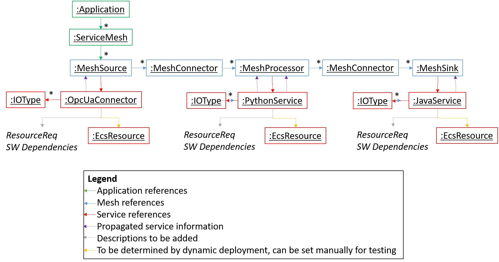

# oktoflow app configuration: Apps and Service Meshes

Applications running on the oktoflow platform consist of connectors and services. The data flow among them is specified in terms of service meshes, i.e., mesh/graph elements like (data) sources, (data) processors and (data) receivers. For example, if the data flow originates at a machine, the corresponding data source is typically implemented by a connector. If the data is passed through a service for processing and data modification, e.g., an AI service, the corresponding mesh element is a data processor implemented by a service. Finally, the point where the data ends is a data receiver, implemented, e.g., by a handover to Grafana through a (reverse) connector or a generic TraceToAAS service.



In an app configuration, `MeshSource` (data source), `MeshProcessor` (processor) and `MeshSink` (receiver) are connected as nodes (refining `MeshElement`) in a service mesh. Each node references the underlying implementing service/connector, allowing the same service to be used in multiple service meshes or multiple times in the same service mesh. Data flows among service mesh elements are specified as `MeshConnector`. An application specifies its constituting service meshes (usually one) as well as technical information.

Table 21 summarizes all configurable fields for mesh and application types. As indicated in Figure 48, MeshElement is the most common type of mesh nodes. MeshSource and MeshInnerElement are refining MeshElement, and, in turn, MeshProcessor and MeshSink are refining MeshInnerElement. Besides constraints that apply, it is important to understand that the input/output data types of mesh elements must not be configured as they are pulled automatically \[14\] from the implementing services and compared along the data flow graph described by the mesh connectors to validate the data flow during configuration validation.

## Application

Fields of the 'Application' type.

| Field |  Description | Default |
| --- |  --- | --- |
| ver | The version of the application. |     |
| snapshot | Is this application a release or a snapshot. |     |
| id  | Unique id used for managing the application. |     |
| name |  Descriptive name used to derive class names from. |     |
| artifact |  Maven artifact coordinate containing the (generated) application implementation. |     |
| services | References to constituting service meshes. |     |
| nameplateInfo | Nameplate information denoting the application creator / vendor. |     |
| createContainer |  Shall containers be created for this application. | false |
| debug | Shall debug output be included into the generated application code. | false |
| withDocs | Shall the application be build with documentation (may affect code templates only, may take more time). | false |
| cmdArg |  Command line arguments to be passed to the application on startup. |     |
| servers |  References to servers belonging to this application. Servers must also be referenced by services requiring individual servers. | {}  |
| packaging |  Packaging scheme, see [platform handbook](../PlatformHandbook.pdf) Section 3.5.3 | SpringFat |
| typeSubstitutions | Substitutes given input/output types by refined input/output types, specified in terms of `TypeSubstitution` instances consisting of `fromType` and `toType` | {} |
| derivedFrom | Name of the template this application is derived from, just as information | null |

## ServiceMesh

Fields of the 'ServiceMesh' type.

| Field |  Description | Default |
| --- | --- |  --- |
| description |  Description of the mesh. |     |
| sources |  References to all mesh data sources. |     |

## Mesh nodes

'MeshElement' is the basic type for all nodes in a service mesh.

| Field | Description | Default |
| --- |  --- | --- |
| name |  Descriptive name of the mesh element. |     |
| kind |  Kind of element, e.g., source, transformer |     |
| impl |  Reference to implementing service. |     |
| ensemble |  References to mesh elements that shall be started by default in the same process. Can be overridden by deployment plan. | null |
| pos_x |  Graphical position in UI editor. | \-1 |
| pos_y |  Graphical position in UI editor. |     |

'MeshSource' is a refined 'MeshElement' stating the point of data ingestion for forward flows.

| Field |  Description | Default |
| --- |  --- | --- |
| next |  Outgoing `MeshConnector` instances |     |
| pollInterval |  If the implementing service supports polling, at which period in milliseconds shall the polling take place. | 1000 |
| output |  Outgoing data types. _Do not fill, pulled from implementing service by propagation._ | _pulled!_ |

'MeshSource' is a refined 'MeshElement' characterizing all non-source (inner) elements.

| Field |  Description | Default |
| --- |  --- | --- |
| next | Outgoing `MeshConnector` instances |     |

'MeshProcessor' is a refined 'MeshInnerElement' characterizing a data processor within a data flow.

| Field |  Description | Default |
| --- |  --- | --- |
| input | Incoming data types. _Do not fill, pulled from implementing service by propagation._ | _pulled!_ |
| output | Outgoing data types. _Do not fill, pulled from implementing service by propagation._ | _pulled!_ |

'MeshSink' is a refined 'MeshInnerElement' characterizing where a data flow ends.

| Field | Description | Default |
| --- | --- | --- |
| input | Incoming data types. _Do not fill, pulled from implementing service by propagation._ | _pulled!_ |

## Mesh connectors

| Field |  Description | Default |
| --- |  --- | --- |
| name |  The descriptive name of the connector. |     |
| next |  The mesh element the connector is connecting to. |     |

## Sub-mesh

A sub-mesh represents a partial re-usable mesh, which actually is a service refines (`ServiceBase`) and allows specifying a mesh, which is substituted wherever the sub-mesh is used in a service-mesh. 

A sub-mesh has all fields of `ServiceBase` as well as the following fields:

| Field |  Description | Default |
| --- |  --- | --- |
| sources |  `MeshConnector` instances pointing to the source mesh elements of this sub-mesh. |     |
| pseudoSink | A single sink where outgoing flows connect to. Will be virtually substituted by the outgoing mesh connectors of the referring `MeshElement`. |     |

## Application Templates

Sometimes it is helpful for users to have already working applications as starting point for own applications. As part of the [DATIpilot ReGaP innovation community](https://regap.de) we are investigating such templates. Currently, a template looks like a normal application, potentially containing sub-meshes, but due to specific conventions, configuration constraints that apply to normal applications are relaxed. In other words, templates may have configuration gaps that are then requested as user input on the user interface. An instantiated template becomes an application that must fullfill all constraints. In contrast to a manually implemented application, such an application model can be extended by the user and the oktoflow application code generation can be exploited as usual.

The current conventions are:
- template IVML files are located in the meta model or in an application the folder `src/main/easy/templates`
- template the name of template IVML files/projects start with `TemplatePart`
- template IVML files contain all application, service mesh, service, connector, datatype and constant definitions in the same file

During template instantiation, the definitions from a single template file are extracted and transferred into the usual structure of a managed configuration. Currently, application and service mesh elements are renamed (to remain unique), while services, data types and constants are taken over for reuse. This is an initial approach that may prove practical or may require changes in the future. The template itself is not modified. 

Further conventions will follow on how to handle re-usable service implementations that shall be distributed along with templates (probably either the oktoflow `defaultLib` or standalone Maven projects, not all-in-one examples).

## An example of Application IVML file

An application IVML configuration file from Asynchronous Python example in Oktoflow platform

```
project ApplicationPartPythonApp {

    import ServiceMeshPartPythonApp*;

    annotate BindingTime bindingTime = BindingTime::compile to .;
    
    Application myPythonApp = {
        id = "PythonApp",
        name = "Simple Python demo flow app",
        ver = "0.1.0",
        description = "",
        services = {refBy(myPythonMesh)}        
    };
    
    freeze {
        .;
    }

}
```

The `ApplicationPartPythonApp` is an application IVML configuration file that is part of the Oktoflow platform examples: [Asynchronous Python](../../examples/examples.python). It imports the `ServiceMeshPartPythonApp*` from the same example, which includes the 'ServiceMesh' for the application. It defines the ID, name, version, description, and 'ServiceMesh' for the application.

## An example of ServiceMesh IVML file

A serviceMesh IVML configuration file from Asynchronous Python example in Oktoflow platform

```
project ServiceMeshPartPythonAppMyMesh {

    import AllServices;

    annotate BindingTime bindingTime = BindingTime::compile to .;

    ServiceMesh myPythonMesh = {
        description = "VDW Service Net",
        sources = {refBy(myPythonSource)}
    };

    MeshSource myPythonSource = {
       impl = refBy(myPythonSourceService),
       next = {refBy(myPythonConnMySourceMyTransformer)}
    };

    MeshConnector myPythonConnMySourceMyTransformer = {
        name = "Source->Transformer",
        next = refBy(myPythonTransformer)
    };

    MeshProcessor myPythonTransformer = {
        impl = refBy(myPythonService),
        next = {refBy(myPythonConnMyTransformerMyReceiver)}
    };

    MeshConnector myPythonConnMyTransformerMyReceiver = {
        name = "Transformer->Receiver",
        next = refBy(myPythonReceiver)
    };
    
    MeshSink myPythonReceiver = {
       impl = refBy(myPythonReceiverService)
    };

    freeze {
        .;
    }

}
```

The `ServiceMeshPartPythonAppMyMesh` is a service mesh IVML configuration file that is part of the oktoflow platform examples: [Asynchronous Python](../../examples/examples.python). It imports the `AllServices` from the same example, which includes the three services created for the application. It defines the data flow for the application starting from the source service and ending with the sink service, as follows:

```

myPythonSource ==>> myPythonConnMySourceMyTransformer ==>> myPythonTransformer ==>> myPythonConnMyTransformerMyReceiver ==>> myPythonReceiver

```


