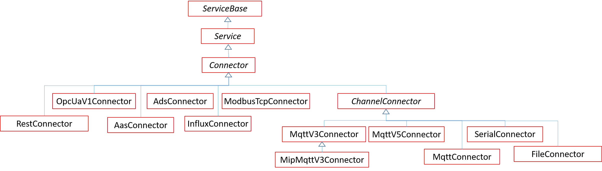

# oktoflow app configuration: Connectors

Connectors represent (access to) external data sources, sinks and processors, e.g., sensors or production machines. Typically, a connector is implemented by some form of protocol that is integrated in the platform, i.e., a connector implementation relies on that implementation and customizes it. Thus, typically connectors are generated, either fully based on the configuration specification or are equipped with certain user-specified plugins. Connectors are based on the specification of the input/output types (in terms of `IOType` instances) connected to the application and the external inInterface/outInterface given in terms of refined `IOType` instances which may hold a path (into the data model of the connector). The example below shows the configuration of a simple MQTT v3 pass-through connector, i.e., JSON data (matching `InputData`) obtained from the MQTT broker on `inputChannel` is directly passed through into the application and similarly `OutputData` from the application to the broker on `outputChannel`. For MQTT, the input channel may be a MQTT pattern and, through operations data can be augmented, e.g., with the channel name (not shown here).

```
MqttV3Connector exampleMQTTCon = {
  id = "ExampleMQTTCon",
  name = "Example MQTT Con",
  description = "My connector",
  ver = "0.1.0",
  host = "127.0.0.1" // rely on default port
  input = {{type= refBy(ResultData)}},
  output = {{type= refBy(InputData)}},
  inChannel = "resultChannel"
  outChannel = "inputChannel",
  inInterface = {type= refBy(ResultData)},
  outInterface = {type= refBy(InputData)},
  traceRcv = TraceKind::TRACE,
  traceSent = TraceKind::TRACE,
  machineFormatter = JsonFormatter{}, //The parser for the transported
  machineParser = JsonParser{}
};
```

Connectors are specialized services. The figure below illustrates the connector type hierarchy defined by oktoflow's meta-model. _Model connectors_ require a structured (model-based) access to the underlying information, e.g., through an OPC UA or an AAS model. In contrast, _channel connectors_ listen to input channels and publish to output channels, possibly with a not further specified data format. Therefore, channel connectors are equipped with a parser/formatter pair, which treates the underlying format, e.g., JSON.  By default, we treat a connector as a model connector unless it refines `ChannelConnector`. While all connectors operate on a certain protocol/format version, `MqttConnector` is a kind of meta-connector, as it allows for dynamically deciding which MQTT protocol version to use (either the respective v3 or the v5 connector) based on data provided by the target device AAS (for ad-hoc connections where the communication port is dynamically defined by the device). 

Specialized services may require refined fields in their input/output types, e.g., with more specific (alias) data types types. Further, specialized connectors may define (fixed) default values, e.g., default ports or symbolic service names for ad-hoc connections.



Please consider that various validity constraints do apply for services, in particular those defined for services. Moreover, connectors are currently only allowed to have at maximum one forward input / output type, while arbitrary many backward types can be stated.

Basically, a 'Connector' supports the following fields (in addition to those of `ServiceBase` and `Service`, see [service configuration details](services.MD)).

| Field | Description | Default |
| --- |  --- | --- |
| class |  Mandatory fully qualified class name of the connector protocol implementation. |     |
| artifact |  Mandatory maven artifact containing the connector protocol, may be empty. |     |
| inInterface |  Mandatory types representing data to be written into the external data sink wrapped by the connector. |     |
| outInterface |  Mandatory types representing data read from the external data source wrapped by the connector. |     |
| operations |  Field-based data translation and assignment operations between inInterface / input and outInterface / output defining special semantics of the connector. | {}  |
| inAdapterClass |  Optional fully qualified Java class names translating data from inInterface to input. If given, no code will be generated for this connector part. | "" |
| outAdapterClass | Optional fully qualified Java class names translating data from outInterface to output. If given, no code will be generated for this connector part. | "" |
| encoding |  Text encoding | ASCII |
| mapping | Field mapping between inInterface / input and outInterface / output. | {}  |
| host | Mandatory network host to connect to. May be superseded by device AAS. |     |
| port | Mandatory network port to connect to. May be superseded by device AAS. |     |
| samplingPeriod | Time in milliseconds between polling two consecutive data samples. If 0, data is received via events, publish-subscribe, etc. | 0   |
| security | Optional security settings pointing to the identity store of the application. | null |
| mock |  Run the connector in mock mode, i.e., read input data from a specification file in the application resources. | false |
| cacheMode |  Shall incoming data be compared to last data point and data only be ingested if differences based on hash codes or equality comparison are detected. | NONE |
| inputHandlers |  Optional plugins to react on data, e.g., to trigger a data-specific sampling request. |     |
| dataTimeDiffProvider |  Optional plugins to adjust data ingestion time differences based on last data points data. |     |
| deviceServiceKey | Optional name for service name to realize ad-hoc connectivity via the device AAS, may, e.g., override host and port. |     |

Entries in `input` and `output` are matched pairwise with the corresponding entries in `inInterface` and `outInterface` as well as `inAdapterClass` and `outAdapterClass`. Typically, the number of matching tuples is determined by `inInterface` and `outInterface`. The remaining entries in `input` and `output` are treated separately, e.g., as backwards/broadcasting input (for input handlers / connector triggers).

In addition, a `ChannelConnector` offers the following fields:

| Field | Description | Default |
| --- |  --- | --- |
| machineFormatter |  Optional pre-defined formatter towards the external data sink, e.g., `JsonFormatter` or `TextLineFormatter`. | null |
| machineParser | Optional pre-defined parser for data read from the external data source, e.g., `JsonParser` or `TextLineParser`. | null |
| inSerializerClass |  Optional qualified Java classes turning application data into external data. If given, supersedes `machineFormatter`. | ""  |
| outSerializerClass |  Optional qualified Java classes turning external data into application data. If given, supersedes `machineParser`. | "" |
| inChannel |  Channel name/pattern for data written to the external sink. | "" |
| outChannel |  Channel name/pattern for data read from the external source. | ""  |
| outChannels |  Optional multiple name/pattern for data read from the external source. If given, supersedes `outChannel`. |     |

While `JsonFormatter`/`JsonParser` do not require further information, `TextLineFormatter`/`TextLineParser` must be configured with a `separator`, e.g., "," for CSV, "\t" for TSV etc. If specified, `inSerializerClass` and `outSerializerClass` contribute to the pairing of `input`, `output`, `inInterface` and `outInterface`.

## OPC UA connector

The OPC UA  connector is a model connector with no further fields.

## AAS connector

The Asset Administration Shell (AAS) connector is a model connector that supports the following additional fields:

| Field | Description | Default |
| --- | --- | --- |
| registryHost | Mandatory hostname of the AAS registry. |     |
| registryPort | Mandatory port of the AAS registry. |     |
| idShortSpec | Mandatory name or Java regular expression denoting the AAS submodel (paths) acting as external source/sink. |     |

Background: 
- The connector was primarily realized for AAS metamodel v2. Through a more recent oktoflow AAS plugin, also metamodel v3 is supported. However, in the future, we may have to distinguish between AAS and sumbodel host/port.

## ADS connector

The ADS connector is a model connector for Beckhoff ADS with no further fields.

## Serial connector

The serial connector communicates with (legacy) serial devices, e.g., EAN code scanners.

| Field | Description | Default |
| --- | --- | --- |
| Host |  Used as COM port. |     |
| baudRate | The baud rate for serial communication. |     |
| dataBits |  The data bits used in serial communication. |     |
| stopBits |  The stop bits used in serial communication. |     |
| parity |  The parity scheme (from NO, EVEN, ODD, MARK, SPACE). |     |

## Modbus/TCP connector

The Modbus/TCP connector communicates with devices such as industrial energy meters.

| Field | Description | Default |
| --- |  --- | --- |
| port |  TCP communication port. | 502 |
| unitId | The MODBUS unit id. | 1   |
| timeout | Connection timeout in ms. | 1000 |
| bigByteOrder | Big or little endian byte order of the connected device (true=big, false=little). | True |

Fields in input/output datatypes shall be of type `ModbusField` rather than `Field` providing the offset of the respective field into the register table of the connected device. In thurn, field types shall be the defined Modbus alias types such as `Modbus_int16` rather than the generic oktoflow types so that the types could be correctly mapped to byte lengths and values.

## Influx Connector (Influx DV v2/v1)

| Field |  Description | Default |
| --- |  --- | --- |
| ssl | Connect by http (false) or https (true). | true |
| urlPath |  Path in the URL used to approach the database. | "" |
| batchSize |  Number of data tuples to write at once. | 1   |
| measurement |  The name of the data tuple type. |     |
| bucket |  The name of the data bucket. |     |
| organization |  The organization holding the database |     |
| baseTime | If float timestamps are provided and intended as elapsed time differences, specifies the time base in ms to obtain timestamps; may be 0 for the point in time when the app is started/the connector instance is created; disabled if not positive | -1|

Fields in in/output datatypes shall be of the specialized type `InfluxField` rather than `Field`, which specifies mapped names for fields (if specific implementation names shall be used) or whether a field is considered as a tag rather than a data field. Usual Fields can be used and are interpreted as they are, i.e., the field name is then the given name.

| Field | Description | Default |
| --- |  --- | --- |
| mappedName | name of the Influx field to use, instead of `name` | |
| tag | is the field a tag | false |

In particular, `LongIndexType` may be used representing here a timestamp in ms since 1970-01-01T00:00:00Z that shall be used instead of the actual time when writing a data point. If not given, the actual (client) point in time when writing the data point is used instead. 

If the specified `bucket` does not exist, the connector will create it in the specified `organization` when a successful connection was established. However, the connector will not create the specified `organization` if it does not exist. If, e.g., permission reasons, `organization` or `bucket` cannot be accessed, further access will fail. 

Please note that only Influx v1 allows for an `USERNAME` token taken from the identity store. n authenticated `InfluxConnector` for Influx v2 expects an issued token, e.g.,

```
identities:
    "influxCloud": 
        type: ISSUED
        tokenData: my-hidden-token
        tokenEncryptionAlgorithm: UTF-8
```

## Influx Connector v3 (InfluxDB v3)

| Field |  Description | Default |
| --- |  --- | --- |
| ssl | Connect by http (false) or https (true). | true |
| urlPath |  Path in the URL used to approach the database. | "" |
| batchSize |  Number of data tuples to write at once. | 1   |
| measurement |  The name of the data tuple type. |     |
| database | The name of the database. |     |
| baseTime | If float timestamps are provided and intended as elapsed time differences, specifies the time base in ms to obtain timestamps; may be 0 for the point in time when the app is started/the connector instance is created; disabled if not positive | -1|

As for the v2/v1 Influx connector, `InfluxField` and `LongIndexType` can be used. For details, see above. For authentication, also the v3 connector expects an `ISSUED` token, see above.

## REST connector

The REST connector allows for connecting with REST data sources/sinks.

| Field | Defined by | Description | Default |
| --- | --- | --- | --- |
| endpointPrefix |  Prefix path to be prepended before each field path. | ""  |

Fields in in/output datatypes shall be of the specialized type `RestField` rather than `Field`, which specifies dedicated REST endpoints for fields (if not the field name shall be used instead) or whether a field is considered a single value or a batch/set.

| Field | Description | Default |
| --- |  --- | --- |
| endpoint | name of the specific endpoint | "" |
| asSingleValue | read the data as single value or as batch | false |

## File connector

The `FileConnector` makes that in local files available or writes to local files, respectively. This is in particular helpful for initial testing of applications, but also required, in particular with CSV format in the energy metering domain. The `FileConnector` is a `ChannelConnector` and, thus, allows for serializers and parsers/formatters to be set up, i.e., to turn the file connector into, e.g., a JSON, a TSV or a CSV connector.

| Field |  Description | Default |
| --- | --- | --- |
| readFiles |  Connect by http (false) or https (true). | true |
| writeFiles |  Path in the URL used to approach the database. | "" |
| dataTimeDiff |  Time between the ingestion of two subsequent data tuples taken from the input file. | `0`  |
| skipFirstLine | Consider the first line as header and skip it | `false` |

The field `readFiles` may contain a single file name, a folder nome or multiple file names (generically as Java regular expressions) determining the files to be read. Files are read from the file system or as app resources. If multiple files are configured, their names are sorted lexicographically to determine the reading sequence. The field `writeFiles` may contain a file or folder in the file system to write incoming data to (if not specified, incoming data will be ignored). Data points read from the `readFiles` may be ingested with a fixed sampling frequency in polling mode or a simulated time in non-polling mode, either as fixed time between subsequent data points (`dataTimediff`) or through a `ConnectorInputHandler` or a `DataTimeDiffProvider` in generated connector integrations based on the last intested data point.

To ease the application, pre-defined `FileConnector` types are `JsonFileConnector`, `CSVFileConnector` and `TSVFileConnector`, each with no further fields.

## MQTTv3 connector

The `MQTTv3` connector is a channel connector with no further fields. Formatters and parsers can be applied as described for the `FileConnector`. 

The `MipMqttV3Connector` is an example of a pre-configured connector with fixed input/output types. The connector is part of oktoflow's default library.

## MQTTv5 connector

The `MQTTv5` connector is a channel connector with no further fields. Formatters and parsers can be applied as described for the `FileConnector`.

## MQTT connector

The `MQTT` connector is a channel connector which selects dynamically between `MQTTv3` and `MQTTv5` connector. The MQTT connector has no further fields. Formatters and parsers can be applied as described for the `FileConnector`.
