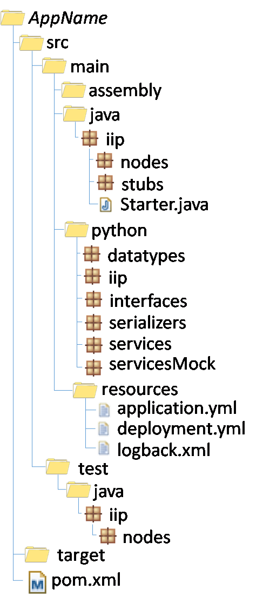

# oktoflow App and Service implementation

From the type, service, mesh and application definitions, oktoflow generates application code for you. This document briefly summarizes relevant code generation concepts.

_This documentation is evolving, so please feel free to contribute._ 

## Overview

The code generation runs in several stages:
- Generation of **interfaces for data types and services for all applications** of a platform instance. These interfaces are needed to generate application code against, i.e., the interfaces represent the parts where you may be obliged to fill your own code into, while the actual application code communicates with your code through these interfaces. It would not be possible to generate parts of the application code without these interfaces, because as long as your code is missing, the application compilation/code cheking process would fail.
  
  Besides pure interfaces, there also implementation classes are generated, for data types, data type serialization and services. By default, all generated classes are in Java. If you employ Python services in your applications, similar Python classes are generated. The `ApplicationInterfaces` project is typically located in the `target/gen` folder. Besides code, also a Maven build process is generated, which packages Java classes in typical jars and Python classes as a Maven ZIP artifact with classifier `python`. Finally, the generated artifacts are deployed to your local Maven repository (and on the SSE continuous integration also onto the public Maven repository of SSE). 

- **Generation of the application.** This can happen in two forms, a) without service dependencies also called `noDeps` so that we can validate the overall generation even without your code. For sure, such an application will not execute successfully. And b) including services, i.e., integrating your code. As a prerequisite, the various configuration concepts name the Maven artifact where the service implementation will be located (may be the same for all service, may differ per service) and the specified Maven artifact(s) must be deployed into a Maven repository where the code generation can access them. Applications are Maven projects with generated build processes for which all the required code to seamlessly integrate your services (if available), the selected connector implementations, the aforementioned data serialization. In the default case, each service/connector is turned into a Spring Cloud Service, which communicates with your service implementation through the aforementioned service interfaces (or further platform-supplied classes, e.g., the Python service environment that communicates as an intermediary proxy with the spring cloud service and your Python implementation).

- As part of the application code generation, in particular the `noDeps`, also **application code templates** are generated. An application code template is a Maven project with generated code files for Java and Python services. As in the usual cases (except for platform-supplied services or state-based services) the oktoflow model does not specify how a service shall be realized, these are the places where you shall fill your code into. This is also the only code that is generated for you to modify it (application interfaces and application classes will be overwritten during code generation). Thus, we recommend to take an application code template as basis for implementing your services. In some cases, when the code generation for these template classes changes, i.e., when you change service names or input/output types, you may be required to diff the generated templates against your code to see which differences must be taken over into your code. At least for Java, the Java compiler will complain if your implemented methods do not anymore conform to the expected application interfaces.

Instead of relying on application code templates, you may also start off with one of the oktoflow examples. However, it's important to note a difference here. Application code templates just focus on the needed service code and do not contain any model. If you design your applications with the oktoflow user interface, you will be able to download such a template when at least a `noDeps` code generation on your application has been carried out. If you use an oktoflow example as basis, this as an all-in-one project for demonstration also containing the application model and the platform configuration. These projects are intended to build a complete (more-or-less standalone) runnable application, and thus require a more complex build process than application code templates.

## Build Processes

Usually there is no need to touch a generated build process. We employ Apache Maven for building platform components and applications, as it is one of the standard tools for Java for this purpose, it allows handling complex versioned dependencies and it also allows to distribute additional artifacts such as Python code. Maven build processes are specified in terms of XML files (`pom.xml`) and in most cases contain the specification of the dependencies (artifact id, group id, version), the repositories from where to get the depdencies (if differing from Maven Central) and the build steps. Build steps are organized in [lifecycle phases](https://maven.apache.org/guides/introduction/introduction-to-the-lifecycle.html) such as compile-test-package-install-deploy the individual build steps (realized by build plugins) are assigned to. In most cases, the default lifecycle phases of the build plugins are sufficient and most of the build steps are pre-defined in the platform parent POM.

Application code templates ship with a generated POM that buildes the classes, validates the Python code, executes Java and Python unit tests (highly recommended, basic code for your services is contained in the templates), packages additional artifacts such as built-in AI models, packages the applications (usually Spring format, see below) installs them to your local maven repository and may deploy them to a specified remote repository.

To keep build processes simple, there are some default locations for files within a project (below for an application project):



Some relevant files and folders
- `pom.xml` contains the build process specification
- `src` contains the source code
  - `main` contains the production source code
    - `java` contains the production Java source code
    - `python` contains the production Python source code (if Python is used for services)
      - `services` contains the production Python code for services. Services may import subfoldes and refer via _relative paths_ to artifacts within this folder 
    - `easy` contains the application model (all-in-one-examples)
    - `resources` contains files that shall be loaded via Java classloading during execution 
  - `test` contains the test source code. Files in this folder are not available during runtime.
    - `java` contains the Java test code, e.g. unit tests
    - `python` contains the Python test code, e.g., unit tests
    - `resources` contains files that shall be loaded via Java classloading during testing.
- `resources` contains application resources that shall be added without packaging/zipping directly to the application
  - `devices` contains device description files for AAS, including images (not relevant for applications)
  - `platform` contains resource files for the platform services (not relevant for applications)
  - `software` contains resource files for all kinds of oktoflow software including applications
- `resources.ipr` optional replacement of the `resources` folder. May contain IPR-protected software that shall not be distributed. Thus, `resources` may be committed to a repository while `resources.ipr` shall be kept private. This folder is considered if specified as build parameter.   
- `target` temporary folder where all files created during a build are stored
  - `gen` the folder where application interfaces, application code and templates are generated
    - `broker` example communication broker for testing (all-in-one examples)
    - `<name>` short name of the project as stated in the build process
       - `ApplicationInterfaces` the generated project for the application interfaces
       - `<name>` the generated project for application `<name>
       - `templates` contains the application code templates
          - `eclipse` contains the application code templates with project layout for Eclipse (works also for VS Code)
            - `<name>` the application code template generated project for application `<name>
            - `<name>.zip` the application code template generated project for application `<name> as ZIP archive (may be easier to import into Eclipse)

However, as mentioned above, all-in-one examples contain both, service implementation and full application, and thus, ship with a more complex build process based on Maven Profiles. For short, a maven Profile contains dependencies and build steps that are specific for this profile, while the dependencies and build steps stated outside any profile apply to all profiles. Usually, we ship such projects with three profiles:
  - `EasyGen` contains dependencies and build steps to instantiate the application model, in particular the [oktoflow configuration Maven plugin](../../configuration/configuration.maven) which implements the build steps described in the Overview section.
  - `App` contains dependencies and build steps for the services. This is required as we sometimes tend to use application-generated code for testing, e.g., to run a connector standalone just to validate its functionality (application code templates contain generated Java applications realizing this purpose). These classes require the generated application (at least from `noDeps` mode), may not yet be generated when the `EasyGen` profile is executed first.
  - `Main` is the default profile which is executed if no further profile is selected. It utilizes oktoflow's variant of the Maven invoker plugin to call the `EasyGen` and `App` profiles and their build steps above.

This background shall then also explain why some build commands look so complicated, e.g. the command for updating oktoflow's meta model `mvn -u -P EasyGen generate-sources -Dunpack.force=true`. `mvn` is the Maven command line command, `-u` demands an update of the Maven artifacts (we want to have the recent version of the meta model), `-P EasyGen` selects the `EasyGen` profile responsible for code generation, `generate-sources` is the specific lifecycle phase the model update is assigned to (implemented by oktoflow's configuration plugin, which is so far only available in the `EasyGen` profile) and `-Dunpack.force=true` is a specific property of the configuration plugin enforcing that the update meta-model artifact is unpacked and the subsequent build process for application interfaces is triggered.  

## Implementation Hints

- If you plan to load files in application code, place them 
  - for Java in `src/main/resources` and load them by name via oktoflow`s `ResourceLoader`
  - for Python in `src/main/python/services` (or any subfolder) and load them using a relative path starting at `services`. Reason is that Python code is packaged as a Maven ZIP artifact during development, packaged into the application artifact, extracted by oktoflow when the service starts, unpacked into a temporary folder within which we start a Python process with exactly that folder as working directory. In other words, your service cannot know where it will be unpacked to and, moreover, folder structures on Windows and Linux differ.   
- Do not perform heavy initialization like AI model loading in the constructor of your classes. This is just the wrong point in time and would disturb the application's bootstrapping. For initializations, there are service lifecycle methods that you can override, e.g., `start` (for doing initial heavy stuff) and `stop` (for discarding heavy or temporary stuff).
- *Upcoming:* Usually, a service creates instances of it's output type(s), transfers data from an input type into that output instance, adds own data and either returns the output data instance (in case of a synchronous service) or ingests the data (in case of an asynchronous service). In Python, this may look like

  ```
  Out o = OutImpl()
  o.field1 = i.field1;
  o.field2 = i.field2;
  #...
  o.fieldx = self.myNiceCalculation(i)
  self.ingest(o)
  ```

  This is tedious for large data types, requires keeping in mind that the implementation of the `Out` type is `OutImpl` and limits generic services to exactly the specified data types. For ReGaP IVML application templates we plan to allow refinable data types so that a template can define a data flow and a user can extend that with more data if needed. However, let `OutRefined` be that type, how shall a service know that it shall create the unknown type `OutRefinedImpl` instead of `OutImpl` and how to transfer unknown fields?

  Future generated base classes of services will contain methods to handle these issues. The code will then look like

  ```
  Out o = createOut()
  transferData(i, o)
  o.fieldx = self.myNiceCalculation(i)
  self.ingest(o)
  ```

  In other words, the services will contain factory methods like `createOut` which automagically create the correct instance as well as a `transferData` function that cares for all (including unknown) data fields. This also addresses the problem that in certain platform configuration the `Out` type contains the full implementation and there is no `OutImpl` which, in these configurations, would render the service implementation incorrect.

  For Java, similar methods will become available. We plan to migrate selected examples as soon as the upgraded code generation is available.
