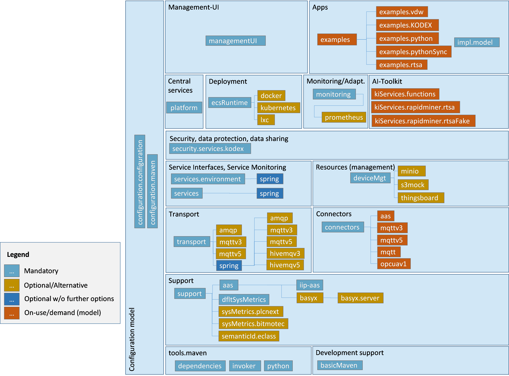

# oktoflow platform

This documentation provides some overview insights into the oktoflow platform and its structure. You will find more details in the [platform handbook](../PlatformHandbook.pdf).

## Platform services

Platform services realized the central administration capabilities of the oktoflow platform. They are respnsible for distributed starting, monitoring and stopping of applications, their services, containers etc. The platform services consist of the same fundamental layers as the applications but add more specific layers to realize platform services. 

The platform shares information via **Asset Administration Shells (AAS)**; commands to be executed, e.g., to start an application, are realized as AAS operations and, thus, operate transparently in distributed fashion. For faster communication but also for data communication among the individual services that constitute an application, the platform typically relies on a **communication broker**, e.g., MQTT or AMQP, depending on the platform configuration. The communication serververs for AAS as well as the communication broker may be started and maintained by the platform, but they may also already be installed and just utilized by the platform (the desired mode is also set up in the platform configuration).

Based on these communication mechanisms, the fundamental platform services are:

- The *serviceManager** (generated startup scripts `serviceMgr.sh/serviceMgr.bat`), which is responsible for starting, monitoring and stopping application services, i.e., the services that you modeled and where needed implemented as realization of an application. Thus, each device where services of an oktoflow application shall be running, must also run at least a service manager (bare metal or in application containers).
- The **ECSRuntime** (generated startup scripts `ecs.sh/ecs.bat`), which is responsible for managing the containers an application is installed into. If enabled, application containers are automatically generated during platform/application installation. The ECSRuntime can obtain them from a central server, start them when need and communicates with the contained service manager.
- The combined **ECSRuntime + service manager**: If devices have limited compute and memory resources, running ECSRuntime and Service Manager as separate processes may be an issue. For such situations, we provide a combined variant (generated startup scripts `ecsServiceMgr.sh/ecsServiceMgr.bat`), which runs both as one process, then assuming bare metal execution of application services.
- The central **monitoring** service (generated startup scripts `monitoring.sh/monitoring.bat`): If enabled, the platform services as well as the application services (through code generation) contain runtime monitoring probes, e.g., on how much memory is consumed or how much data flows through an application service. The platform monitoring service is an optional service that collects this information and displays it on a user interface (using prometheus). Instead of the platform monitoring service, also an already installed monitoring system like prometheus be utilized.
- The **platform** service (generated startup scripts `platform.sh/platform.bat`) is responsible for setting up and maintaining the platform AAS. If enabled, it starts and manges the AAS server processes. It can also be combined with the platform monitoring service.
- The **management** user interface (generated startup scripts `mgtUi.sh/mgtUi.bat`) is an optional webbased JavaScript management frontend for the platform. In addition to providing an overview on the running platform services, it allows for modifying the application configurations and supports application development. For basic command line tasks, also the platform Command Line Interface (generated startup scripts `cli.sh/cli.bat`) can be used.

Please note that all platform services can run on a single computer. Moreover, each oktoflow application can run locally as a Java application, where at least the communication broker must be started before.

## Mapping of Projects to Platform Layers

The platform consists of more than 60 implementation projects. Although the follow a naming scheme starting with the platform component name, it may be difficult at the beginning to understand the mapping between projects, components and layers. The figure below illustrates the mapping and the structure.

## Communication Channels

Besides the services and their technical network addresses, the platform also uses some pre-defined Transport Layer channels. These channels are briefly summarized in the table below. It is important that channels are independent of the transport protocol, i.e., apply equally to, e.g., MQTT or AMQP. Moreover, the default metrics channels currently use a fixed JSON format and rely on a default String serializer defined in the Transport Layer. The service channels use an application-specific format determined by the active serializer and the code generation of the platform instantiation process.

| Channel | Kind | Component | Format | Explanation |
| --- | --- | --- | --- | --- |
| EcsMetrics | global | ECS Runtime | JSON | Metrics reporting by ECS Runtime |
| ServiceMetrics | global | Service Mgt., Service Env. | JSON | Metrics reporting by Services, can be augmented by application-specific metrics. |
| ComponentStatus | global | _all_ | JSON | Notification about added, changed, removed components. Format pre-defined in transport component. |
| Trace | global | _All_ | JSON | Optional notification about received/sent data or parameter changes. Enabled per service via configuration model. Format pre-defined in transport component. |
| Alert | global | _all_ | JSON | Notification about monitoring alerts, format pre-defined in transport component. |
| data__&lt;service&gt;\_&lt;function&gt;_ &lt;app&gt;\_&lt;instance&gt;_ | global | Application | _application specific_ | Inter-device transport channels per service and function. The channel name also contains the application identifier and, if utilized, the application instance id (may be omitted including the separating underscore). |
| data__&lt;service&gt;\_&lt;function&gt;_ &lt;app&gt;\_&lt;instance&gt;_ | local | Application | _application specific_ | Intra-device transport channels per service and function (similar to global service transport channels above). |

Due to problems with Spring Cloud Stream for asynchronous data injection, a workaround for connectors uses further, undocumented streams. In future versions, we plan to completely rely on Spring Cloud Stream to be able to exploit existing binders. If this fails for technical reasons, we will detail the stream names here.

## Command Line Parameters

The platform services recognize the command line parameters in format `--<parameterName>=<value>` (initially, all properties/parameters were prefixed with "iip". We tend to migrate those to “okto” over time) in the table below:

| Parameter name | Explanation | Default |
| --- | --- | --- |
| iip.port | Network port on which the AAS implementation server shall be running. Overrides the respective value in the platform configuration as well as the environment setting with the same name. May be helpful to setup containers. | _Platform configuration_ |
| iip.port.svcMgr | Overrides iip.port but only for the service manager. | _Platform configuration_ |
| iip.id | Device id as used by the ECS-Runtime and the service manager (use consistently, service manager must have same iip.id as corresponding ECS-Runtime). Depending on the strategy realized by the active IdProvider, a device id given on the command line may be ignored. The default provider considers the command line. | MAC-based IdProvider |
| iip.profile | Start the given lifecycle profile via its name. The default profile starts all lifecycle descriptors of a component. See Table 10 for available lifecycle profiles. | "default" |

## Lifecycle profiles

Table 10: Lifecycle profiles defined by the platform.

| Component | Lifecycle Profiles | Default |
| --- | --- | --- |
|Monitoring integration for Prometheus| - Monitoring.prometheus: Start the full integration in an own JVM.   - Prometheus: Start only the platform-provided Prometheus through an own JVM.   - Prometheus.exporter: Start only the platform side of the integration, i.e., metrics exporter and alert manger integration in an own JVM |Start the full integration with the platform component; conflicting with BaSyx.|

## System Properties / Environment variables

Moreover, the platform recognizes the following more overarching (Java) system properties (stated as `-D<property>=<value>`, if given in uppercases also the respective system property is considered).

| Property | Explanation | Default |
| --- | --- | --- |
| iip.pid.dir | Directory where process identification files (PID) in Unix style are stored. These files indicate that a certain process was started. This information can be helpful when automatically starting platform processes, e.g., through a process manager. Default files are `iip-platform.pid`, `iip-ecsRuntime.pid` and `iip-serviceMgr.pid`. | The system's temporary directory. |
| iip.port  IIP_PORT | Network port on which the AAS implementation server shall be running. Overrides the respective value in the platform configuration. May be helpful to setup containers (usually then the capitalized form in Linux/Bash style). | _Platform configuration_ |
| iip.port.svcMgr  IIP_PORT_SVCMGR | As iip.port, overrides the given value but only for the service manager. | _Platform configuration_ |
| iip.supportedAppIds | Comma separated list of application ids that are particularly supported by the reading service manager. | _Environment variable with same name_ |
| iip.identityStore | Folder containing the identity store with the file name / format required by the actual pluggable identity store. | .   |
| iip.installedDeps | Folder containing the installedDependencies.yml file required by the service manager and individual services. | .   |
| iip.app. | Name prefix of system properties to be passed on to the running service applications, e.g., to ease debugging. Implicit properties are iip.app._c_.inPath and iip.app._c_.outPath with _c_ the id of a model connector as specified in the application/platform configuration. | \-  |
| iip.devices.plcNext.   grpc.sock | Location of the GRPC socket for the optional PLCnext system-level monitoring plugin. | /run/plcnext/   grpc.sock |
| iip.eclass.keystoreKey | Identity store key providing access to the authentication certificate for the ECLASS web service. | eclassCert |
| iip.eclass.locale | Locale used as preferred result language when querying the ECLASS web service. | System locale |
| iip.test | Boolean flag indicating that an application shall be executed in testing mode. Testing mode currently enables file-based data recording on mesh sources and mesh sinks. | False |
| iip.test.dataFile | Name of the data file in generated service/connector tests. Typically, as documented in the generated code, the default is a service-specific file name, but may be overridden, e.g., for continuous integration. | _As documented in generated code_ |
| okto.plugins | Comma/semicolon separated list of unpacked plugin root folders to load. |     |
| okto.aasFactoryId | Plugin-id of the `AasFactory` to use. | _aas-default_ |
| iip.plugins | Folder where oktoflow plugins are located | `target/plugins` or `target/oktoPlugins`|

## Environment variables

In addition to mixed system property/environment variables, there are for technical reasons also some sole environment variables.

| Property | Explanation | Default |
| --- | --- | --- |
| IIP_SUPPORTED_APPIDS | Comma separated list of application ids that are particularly supported by the reading service manager (similar system property, here to ease container instantiation). |     |

## Extension mechanisms

oktoflow components hook into each other via the Java Service Loader and the platform's plugin mechanism. We document here the extension mechanisms used in the platform components (\* indicates the multiplicity).

| Layer/   Component | Settings | Supported JSL descriptors |
| --- | --- | --- |
| Support | \-  | de.iip_ecosphere.platform.support.LifecycleDescriptor\*  de.iip_ecosphere.platform.support.LifecycleProfile\*  de.iip_ecosphere.platform.support.aas.AasFactoryDescriptor  de.iip_ecosphere.platform.support.aas.ProtocolDescriptor  de.iip_ecosphere.platform.support.aas.AasServerRecipeDescriptor de.iip_ecosphere.platform.support.net.NetworkManagerDescriptor  de.iip_ecosphere.platform.support.iip_aas.AasContributor\*  de.iip_ecosphere.platform.support.iip_aas.IdProviderDescriptor  de.iip_ecosphere.platform.support.metrics.SystemMetricsDescriptor\*  de.iip_ecosphere.platform.support.identities.IdentityStoreDescriptor  de.iip_ecosphere.platform.support.resources.ResourceResolver\*  d.i.p.support.semanticId.SemanticIdResolverDescriptor\* |
| Transport | \-  | de.iip_ecosphere.platform.transport. TransportFactoryDescriptor  de.iip_ecosphere.platform.transport.status.TraceRecordFilter |
| Connectors | \-  | de.iip_ecosphere.platform.connectors.ConnectorDescriptor |
| Services | iipecosphere.yml | de.iip_ecosphere.platform.services.ServiceFactoryDescriptor |
| Resources / Monitoring | iipecosphere.yml | de.iip_ecosphere.platform.ecsRuntime.EcsFactoryDescriptor  de.iip_ecosphere.platform.ecsRuntime.deviceAas.DeviceAasProviderDescriptor\* |
| Device management | Iipecosphere.yml | de.iip_ecosphere.platform.deviceMgt.storage.StorageFactoryDescriptor  de.iip_ecosphere.platform.deviceMgt.registry.DeviceRegistryFactoryDescriptor |
| Configuration | iipecosphere.yml | \-  |
| Platform | iipecosphere.yml | \-  |

### Support Component

The Support Component does not take specific settings into account rather being set up through upper platform layers/components and plugins (_to be documented_). In particular, the Support component defines several fundamental JSL descriptors to allow the upstream platform components to hook into at defined points or to allow for external extensions. We summarize the descriptors now and link them to the variability provided by the platform and the platform configuration approach. The descriptors are:

- **LifecycleDescriptor** which allows adding components to the startup/shutdown process of a platform component. These descriptors can indicate a certain startup level and they even can cause a shutdown of a platform component. Adding certain descriptors to a platform binary causes the respective components to be started. Upper platform components ship with their descriptor file  so that either we add a certain component or a descriptor to the instantiated platform binaries (positive variability) becomes then active. In seldom cases, we may add the component and remove the descriptor to disable the respective registration (negative variability).
- **Lifecycle profiles** (c.f. Section 3.3.3 in the [platform handbook](../PlatformHandbook.pdf)) may be a resort when individual parts of larger lifecycle shall be executed separately, e.g., to virtualize these parts. A `LifecycleProfile` allows for defining the lifecycle descriptor to be executed when the profile becomes active. A component may define multiple (alternative) profiles.
- `AasFactoryDescriptor` indicating the AAS factory to be used. A specific descriptor is shipped with the AAS (abstraction) implementations, e.g., for BaSyX 1.3 or BaSyX 2. The current default implementation is `support.aas.basyx` for BaSyX 1.3. The platform just takes the first available descriptor (excluding potential descriptors used in testing), allowing here only for a single choice variability. By including a certain AAS implementation component, i.e., adding it to the platform classpath, the descriptor is made available and the respective factory becomes active (positive variability) as done during platform instantiation.
- `ProtocolDescriptor` is an optional extension descriptor indicating AAS implementation protocols that are not shipped with the platform. By default, TCP and HTTP/REST protocols are provided, but other protocols may be supported by a certain implementation. Here, additional external components can add arbitrary protocols (positive, unlimited variability) as long as the protocol names are unique. New protocols must be added to the configuration model as potential alternative so that the selected/desired protocol can be specified while instantiating the settings of the upper components.
- `AasServerRecipeDescriptor` defines the specific recipe to be used when creating an AAS server. The AAS abstraction defines a local server recipe for in-memory storage. However, on a server sided installation, also a persistent storage of the AAS may be required, which can lead to a large set of dependencies and unnecessary allocation of resources on edge devices. The required behavior, storage options but also dependencies can be defined by a specific AAS server component.
- `NetworkManagerDescriptor` is an optional descriptor that indicates which network manager shall be used by a component. The Support component does not ship with any descriptor information so that the platform instantiation must provide respective files. One alternative to the local manager is a global AAS-based network manager for some ports backed by a local network manager.
- `AasContributor` is an extension descriptor for higher level platform components to conveniently build a common AAS for the platform. AAS contributors define specific sub-models and announce their presence through the AasContributor descriptor, i.e., any descriptor found will be used to set up the common AAS for the platform. Examples in the Support Component are the platform nameplate sub-model and the network manager AAS (providing access to the network manager selected by the NetworkManagerDescriptor). Although the descriptors shipped with the platform are intended to be executed, the platform instantiation may add or remove specific contributors to customize the AAS of a certain component. Moreover, the descriptors can declare themselves as invalid as, e.g., instances required to implement the AAS are not present.
- The `IdProviderDescriptor` is an optional descriptor indicating which strategy shall be used to determine the identification of a device. By default, the platform uses the MAC address of the device that is enumerated first by the system as device id. This default provider also allows for overriding the device id from via a command line parameter (cf. Table 11), in particular for testing. When used in an AAS, the provided device id may be modified so that it complies with the rules of an AAS short identifier, e.g, additional characters may be prefixed or whitespaces may be removed.
- The `SystemMetricsDescriptor` is an optional descriptor allowing to define a target-system specific implementation of the system metrics (cf. Section 3.3.5 in the [platform handbook](../PlatformHandbook.pdf)). Multiple system metrics descriptors can be specified, which may include system specific metrics descriptors. Of course, only one descriptor shall be active. Thus, with higher precedence, the first descriptor in the loading sequence is selected that declares itself as enabled, e.g., based on certain vendor system properties that uniquely identify a system installation. If none is enabled, a fallback descriptor, such as the default metrics via `jSensors` is activated. If no such fallback descriptor is available, the default metrics plugin is activated, which just returns constant values.
- The `IdentityStoreDescriptor` is an optional descriptor to define the actual implementation of the identity store. The current default is the `YamlIdentityStore` reading `identityStore-ipr.yml`, `identityStore.yml` or `identityStore-test.yml` as fallback from the classpath, during development also in `src/main/resources` or in `src/test/resources`.
- The `ResourceResolver` realizes a strategy to load file-based program resources (cf. Section 3.3.14 in the [platform handbook](../PlatformHandbook.pdf)). The basic strategy loads from the root folder of a Jave archive. Additional resolvers may, e.g., treat sub-folders of such an archive as root folder for the resolution, e.g., as the resolver for the Spring FAT Jar format. As the ResourceResolver is descriptor and resolution strategy, we decided to drop the usual "Descriptor" name suffix here.
- The `SemanticIdResolverDescriptor` allows hooking one or multiple semantic id resolvers (see Section 3.3.15 in the [platform handbook](../PlatformHandbook.pdf)) into the platform. Two pre-defined descriptors are based on local excerpts of ECLASS and the admin-shell.io IRI namespace, a further one is the REST-based semantic Id resolver utilizing the ECLASS web service.

### Transport Component

The Transport Component in the Transport and Connectors layer does not define own settings. This is done by the `TransportFactoryDescriptor` to allow concrete transport protocol implementations to hook themselves into the `TransportFactory`. Moreover, it offers adding serializer implementations to the `SerializerRegistry`. For a concrete application, the respective serializers are created during platform instantiation and registered through generated code in the `SerializerRegistry`.

### Connectors Component
The Connectors Component in the Transport and Connectors layer defines the `ConnectorDescriptor` for announcing available descriptors that can be used / shown up in the AAS sub-model of the Connectors Component.

### Services Component
The Services Component takes setup information from a unified YAML file called `iipecosphere.yml`, which must be present on the classpath of the component (4. The detailed settings are documented in the README.MD file of the respective component). This file is instantiated through the configuration model during platform instantiation and added to the respective instantiated components. Depending on the service manager to be used, specific setup information may be required, e.g., for Spring Cloud Streams the full breath of the used Spring Components can be configured in this file (in Spring applications, this file is typically called `application.yml`. The name for the platform is different, also as Spring is only used in alternative components). Moreover, the Services component defines the `ServiceFactoryDescriptor` that announces the actual `ServiceManager` to be used.

### ECSRuntime Component

Similarly, the ECSRuntime Component in the Resources and Monitoring Layer utilizes own entries in its `iipecosphere.yml` file and provides an own descriptor (`EcsFactoryDescriptor`) to announce the configured container manager. The AAS structure of the platform relies on devices with own AAS. However, it is unclear where the AAS for a certain device does come from, in particular if the device is already older or the vendor does not provide an AAS. To handle these cases, the ECS runtime allows to customize the AAS origin via the `DeviceAasProviderDescriptor`, which determines the component that returns the address of the respective device AAS (the component may also create the AAS if needed). By default, the platform reads/constructs an AAS from a simple Yaml file (with associated images) or an AASX file resolved from the classpath (see also Section 3.6.1 in the [platform handbook](../PlatformHandbook.pdf)).

### Configuration Layer

In the Configuration Layer, the Configuration Component considers specific settings in the `iipecosphere.yml` file, e.g., where to find the configuration meta-model, the platform configuration, where to write instantiated components to etc. As the configuration component will offer own operations to modify the configuration, it also utilizes the descriptors defined by other components/layers, e.g., the `AasContributor`, to hook itself into the platform mechanism to create a joint platform AAS.

### Platform Component

The Platform Component is a collection of the basic services to be started, in particular a (persistent) AAS server or a global network manager. Thus, it requires specific setup information in the `iipecosphere.yml`, e.g., on which port and using which implementation protocol the global platform AAS shall be set up (the individual AAS are then remotely deployed into this AAS server).
