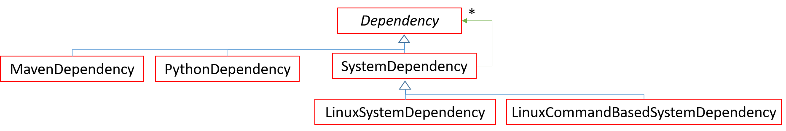

# oktoflow app configuration: Services

A service represents a (usually remotely deployable) unit of work, which receives data and produces results in synchronous (one result per input data point) or asynchronous (none, one or multiple results per input data point, also at any point later in time). Services can receive multiple types of data and produce multiple types of data, usually along the specified service mesh, but also in backwards direction (publish-subscribe). The unit of work may be pre-defined by the platform or implemented in a specified Java/Python class in a specified Maven artifact. An AAS nameplate can be associated with a service. [Connectors](connectors.MD) are specialized services with a platform-supplied implementation.


As an example, the following fragment specifies a Java source service implemented by the class given in the field class realized in the given Maven artifact.

```
Service mySourceService = JavaService {
  id = "SimpleSource",
  name = "Simple Data Source",
  description = "",
  ver = "0.1.0",
  deployable = true,
  asynchronous = true,
  class = "de.iip_ecosphere.platform.test.apps.serviceImpl.SimpleSourceImpl",
  artifact = "de.iip-ecosphere.platform:apps.ServiceImpl:" + iipVer,
  kind = ServiceKind::SOURCE_SERVICE,
  output = {{type=refBy(rec1)}}
};
```

As shown in the service hierarchy above, oktoflow pre-defines the generic service types `JavaService` and `PythonService` where a user-supplied implementation defines the unit of work as well as the customizable services `KodexService`, `RtsaService`, `TraceToAasJavaService` that ship with a platform-supplied customizable implementation.  `FlowerFederatedAiService` is a customizable service, where the platform generates a basic implementation for Flower federated AI services, which must be complemented by a user-supplied implementaiton. Specialized services may refine fields with more specific types or define (fixed) default values.

Various validity constraints do apply for services, e.g., sources must have at least one forward output type, transformers at least one input and output forward type and sinks at least one forward input type. Further, arbitrary many backward types are allowed, whereby per backward type at least one service shall declare the backward type output as otherwise no data will flow. These constraints are defined in the oktoflow meta-model. 

The common fields (some fields are detailed below) of all service types defined by `ServiceBase` and `Service` are:

| Field | Description | Default |
| --- | --- | --- |
| id  | Mandatory unique id for deployment plans and management operations. |     |
| name | Mandatory name to be turned into programming language name during instantiation. |     |
| kind |  Mandatory kind of service, one of SOURCE_SERVICE, TRANSFORMATION_SERVICE, SINK_SERVICE, PROBE_SERVICE |     |
| asynchronous |  Shall data be processed in synchronous or asynchronous manner. Affects interface. | True |
| input | Mandatory sequence of input types, wrapped into IOType instances (type referencing to the transported DataType, forward to the transport direction) |     |
| output |  Mandatory Sequence of output types, wrapped into IOType instances (type referencing to the transported DataType, forward to the transport direction) |     |
| dependencies |  Required dependencies of the service as a list of references to, e.g., system installations or Python dependencies | {}  |
| nameplateInfo |  AAS setup including product image, product designation and reference to manufacturer. |     |
| memLimit |  Memory limitation in Mbytes. | 0   |
| parameter |  Sequence of service parameters that can be re-defined at application/service startup or during runtime. May be IntegerParameter, StringParameter, RealParameter, BooleanParameter or LongParameter, each with default value and system property to read a startup value from. | {}  |
| server |  Optional reference to the server instance required for operation. Server instances are bound to the service lifecycle and, if required, started before / stopped after a service, but only once per installation. |     |
| requires |  Optional set of required device types the service can run on. |     |
| monitorRcvCount |  Shall the number of received data tuples be monitored and reported during runtime. | True |
| monitorSentCount |  Shall the number of sent data tuples be monitored and reported during runtime. | True |
| monitorProcessingTime |  Shall the processing time per data tuple be monitored and reported during runtime. | True |
| traceRcv |  Shall the service operations be traced, e.g., to the tracing stream (TRACE, TRACE_NO_DATA) or through logging (LOG, LOG_NO_DATA) or on the console (SYSOUT). | NONE |
| traceSent |  Shall the service operations be traced, see traceRcv. | NONE |
| plugins | References to plugins used/required, e.g., to use the AAS factory from the specified plugin instead of the default factory. | {}  |
| description |  Mandatory textual description for the service, e.g., to be included into documentation. May be empty. |     |
| ver |  Mandatory version of the service |     |
| deployable |  Mandatory flag for central or remotely deployable service. | True |
| artifacts | Optional set of names of file names in the artifact that shall be unpacked with this service. |     |

Forward entries in `input` and `output` are matched pairwise, i.e., the first type in `input` is the input type for producing an instance of the first type in `output`. Non-forward (broadcast) entries are treated separately.

## Authentication and Security

The compound types `AuthenticationSettings` or `SecuritySettings` represent the information to specify authentication or encryption information given in an identity store (cf. see [platform handbook](../PlatformHandbook.pdf), Section 3.3.13) to be passed on to the implementation of, e.g., a connector. In the simplest case of an `AuthenticationSettings` instance, e.g., in a service, looks like the following example:

```
security = {
  authenticationKey = "amqp"
}
```
Fields of the `AuthenticationSettings` type:

| Field | Description | Default |
| --- | --- | --- |
| authenticationKey | Mandatory: Identity store key indicating the identification token to be used. Must not be empty. |     |
| enableTokenExport | Optional setting whether the referenced identity token may be exported, e.g., to create a UI. |  false   |

 The `SecuritySettings` compound type extends the authentication settings compound by specifying a keystore to be used for TLS encryption. As connectors or the transport setup usually defines a configuration variable based on AuthenticationSettings, applying security settings typically looks as follows:

```
security = SecuritySettings {
  authenticationKey = "amqp",
  keystoreKey = "amqpTLS",
  keyAlias = "iipTLS"
}
```

Fields of the `SecuritySettings` type extending the `AuthenticationSettings` type as shown above:

| Field | Description | Default |
| --- | --- | --- | 
| keystoreKey | Mandatory: Identity store key indicating the token defining the keystore to be used and the (optional) user name and password to open the keystore. If not given, an implementation may resort to authenticationKey. |     |
| keyAlias | Mandatory: The alias name of the certificate to be used in the keystore. |     |
| hostnameVerification |  Shall the hostname of the server to be connected with the given authentication/security settings be verified. | false |

## AAS Nameplate Settings

Platform supplied services and connectors ship with vendor information to fill the service nameplate automatically. Application-specific services may optionally include this information. However, we recommend to provide vendor nameplate information. The platform defines some default nameplates for IIP-Ecosphere partners in the configuration meta-model, which may be reused. Moreover, service-specific nameplaces can be given in meta-model extensions or along with the configuration application-specific services (then usually in `AllServices.ivml`). The definitions of the fields in the meta-model are equipped with respective semantic IDs.

An example for a (simplified) manufacturer configuration for the SSE group of University of Hildesheim is stated below:

```
Manufacturer manufacturer_sse = {
  manufacturerName = "Universitaet Hildesheim@de",
  manufacturerLogo = "SSE-Logo.png",
  address = {
    department = "Software Systems Engineering@de",
    street = "Universitaetsplatz 1@de",
    zipCode = "31141@de",
    cityTown = "Hildesheim@de"
  }
};
```

Please note that the used strings end with an indicator (after the @) for the used language. The `manufacturerLogo` is either a full (external) URL or indicates the name of a PNG/JPEG file to be located in the resources folder, more specifically

1. the software subfolder of the platform's `configuration.configuration` component in case of a namepate defined in the configuration meta-model
2. the software subfolder of the application project for an application-specific nameplate.

A defined nameplate entry can be applied, e.g., in a service or connector, as shown below

```
nameplateInfo = {
  manufacturerProductDesignation = "ADS connector@en",
  manufacturer = refBy(manufacturer_sse)
}
```

Here the `nameplateInfo` defines the product designation of a connector and the manufacturer refers to the manufacturer information shown above.

The fields of the `NameplateInfo` type are:

| Field | Description | Default |
| --- | --- | --- |
| productImage |URL or relative file name of product image. | ""  |
| manufacturerProductDesignation | Product designation text given by the manufacturer. Shall be given with language indication as postfix. | ""  |
| manufacturer | Mandatory: Reference to reusable manufacturer configuration. | "" |

The fields of the `Manufacturer` type are:

| Field | Description | Default |
| --- | --- | --- | 
| manufacturerName | Name of the maufacturer. Shall be given with language indication as postfix. | ""  |
| manufacturerLogo | URL or relative file name of the manufacturer logo. | ""  |
| manufacturerAddress |  Contained compound instance specifying the address of the manufacturer. |     |

The fields of the `ManufacturerAddress` type are:

| Field | Description | Default |
| --- |  --- | --- |
| Department | Responsible department within the manufacturer's organization. Shall be given with language indication as postfix. | "" |
| street | ManufacturerAddress | Street of the manufacturer's address. Shall be given with language indication as postfix. | ""  |
| zipCode | ManufacturerAddress | ZIP codeof the manufacturer's address. Shall be given with language indication as postfix. | ""  |
| cityTown | ManufacturerAddress | City/Town of the manufacturer's address. Shall be given with language indication as postfix. | ""  |

## Parameters

Parameters can be attached to services and connectors in order to parameterize the implementation, either through the configuration, i.e., at instantiation/code generation time, at startup or (via the service AAS) at runtime. Parameters are typed allowing respective IVML expressions to determine the parameter's default value. Parameters are turned into accessor methods of the service base implementation and can be obtained from there. Please note that the Parameter type is abstract and only sub-types can be used for configuring parameters.

The example below indicates a `String` and an `Integer` parameter with the respective name, value and the optional system property (taken up from the startup arguments of an application, e.g., through a deployment plan of the respective application).

```
parameter = {
  StringParameter {
    name = "camIP",
    defaultValue = "127.0.0.1",
    systemProperty = "iip.app.hm23.camIP"
  }, IntegerParameter {
    name = "robotId",
    defaultValue = 1,
    systemProperty = "iip.app.hm23.robotId"
  }
}
```

The fields of the parameter configuration types are: 

| Field | definedBy | Description | Default |
| --- | --- | --- | --- |
| name | Parameter | Mandatory name of the parameter. |     |
| systemProperty | Parameter | Optional value of the system property to be read upon application startup. | ""  |
| defaultValue | Parameter |  The default value, depends on the actual parameter type. |     |
| defaultValue | IntegerParameter | Mandatory: Integer default value. |     |
| defaultValue | StringParameter | Mandatory: String default value. |     |
| defaultValue | RealParameter | Mandatory: Real default value. |     |
| defaultValue | BooleanParameter | Mandatory: Boolean default value. |     |
| defaultValue | LongParameter | Mandatory: Long default value (given as Integer). |     |

## Dependencies

Dependencies indicate components that are required by the platform, a service or a connector. Although at a glance only descriptive information, these dependencies instruct the container instantiation which software is needed in a service container to run the services of an application. Using system dependencies, services can specify the version of their execution environment, e.g., a certain Python version with Conda for virtual environments.



Currently, oktoflow knows `MavenDependency` for Java components as well as oktoflow binary components, `PythonDependency` for Python packages to be installed with a Python package manager and `SystemDependency`, which are refined to Linux dependencies to be installed with a Linux package manager and Linux command based installations which require the execution of a script. Dependencies may have sub-dependencies, e.g., indicating the minimum required Python packages for an oktoflow installation.

Examples for reusable platform-defined dependencies (applications may define their own ones):
- Java: JRE8, JDK8, JRE11, JDK11, JDK17, JDK21
- Python: PYTHON2, CONDA, VENV (through Python), PYTHON3, PYTHON38, PYTHON39, PYTHON313
- Python packages: NumPy1220, tensorflow280, tensorflow290, tensorflowNoVersion, keras290, pytorch201, pickle4_001, pyyamlNoVersion, pyyaml60, pyyaml602, pyflakesNoVersion, pyflakes250, websocketsNoVersion, websockets1102, pyzbar019, OpenCVPython45564, NumPy1201, NumPy224, Pillow910, Pillow1110
- Linux system dependencies: linuxTestingMaven (requiring `maven`), linuxTestingNetworkUtilsRoute (requiring `net-tools`), linuxTestingNetworkUtilsTraceroute (requiring `traceroute`), linuxTestingNetworkUtilsPing (requiring `iputils-ping`), linuxTestingNetworkUtilsWget (requiring `wget`), linuxTestingFileUtilsLess (requiring `less`), linuxTestingFileUtilsNano (requiring `nano`), linuxTestingFileUtilsTail (requiring `tail`), linuxTestingProcessUtilsProcps (requiring `procps`)
- Linux command-based system dependencies: SysPythonNative (requiring `apk add make automake gcc g++ subversion python3-dev`)
- Maven dependencies: mvnDefaultLib (requiring the oktoflow default library for services)

## Server

A server is an optional process associated to an application, in particular to the application lifecycle, i.e., a server is started once with the application (even if multiple instances of the application are started) and stopped with the last instance of that application. Akin to services, a server may declare an AAS nameplate, which is displayed in its (service-like) AAS. In contrast to services, the communication between a service or an application with the server is independent of the configured data flow of a service mesh and may be realized using custom communication protocols (or, as recommended approach, rely on the platform transport for uniform communication). Currently, the platform supports Java servers (implementing the platform Server interface) and Python servers (based on a generate interface) wrapped by a generated Java server.

In the configuration, a server receives a default host and port, which can be re-defined in a deployment plan and will be re-configured upon startup of the associated application. Thereby, the respective host and network port will be registered with the platform network management (see [platform handbook](../PlatformHandbook.pdf), Section 3.3.2). Services that rely on a server shall declare a reference to the server in the configuration and will then receive via the service interface the actual host and port of the related server. This approach allows relocating server instances dynamically upon application start.

The example below illustrates the configuration of a Java server. Besides similar basic configuration options as services, a server may receive configured startup options through its command line arguments (`cmdArg`), here a string of options where in particular the pattern `${port}` is replaced by the actual port. Other options specifying this would be repeating the configured port number or stating an IVML expression based on an IVML variable used for both, port and cmdArg.

```
JavaServer aasServer = {
  id = "car-aas-server",
  description = "AAS car server",
  ver = "0.0.1",
  host = carAasServer,
  port = 9989,
  class = "de.iip_ecosphere.platform.examples.hm23.carAas.CarsAasServer",
  cmdArg = "--port=${port}"
};
```

The configuration of a Python server looks rather similar. The integration of the federated learning framework Flower defines a refined `PythonServer` type with default values that are specific to the Flower integration easing the configuration of a Flower service.

The fields of the `Server` type are: 

| Field | Description | Default |
| --- | --- | --- |
| id  |  Mandatory unique id for deployment plans and management operations. |     |
| description |  Mandatory textual description of the server instance, may be empty. |     |
| ver | Mandatory version of the server |     |
| host | Mandatory default host name or IP address of the machine the server process shall run. | 127.0.0.1 |
| port | Mandatory network port to be allocated by the server instance. |     |
| executable | Mandatory specification of the binary executable implementing the server. May be superseded by refined server types. |     |
| nameplateInfo | The nameplate information of the vendor of the server. |     |
| artifact | Optional the Maven coordinate of the artifact containing the server implementation. | “�  |
| running | Is the server already running, i.e., just declared, or shall it be started by the platform as part of the application lifecycle. | false |
| parameter | Optional parameters akin to service for startup and runtime reconfiguration. | {}  |
| dependencies | Optional: Required dependencies, e.g., Python dependencies. | {}  |
| transportChannel | Optional channel name if platform transport shall be used for communication, what is the (base) name of the transport channel to be used by the server and the using services. |     |
| artifacts |Optional additional file names of artifacts to be unpacked into the servers temporary execution directory, e.g., required AI models. |     |

In addition, a `JavaServer` supports the following settings.

| Field |  Description | Default |
| --- |  --- | --- |
| class |  Mandatory fully qualified Java class name to execute (instead of executable). |     |
| cmdArg |  Optional command line arguments to be passed to the server instance upon creation/startup. |     |

As another refinement of `Server`, a `PythonServer` supports the following settings.

| Field |  Description | Default |
| --- |  --- | --- |
| executable | Mandatory executable with default name python. Internally executed via the python service environment taking up the required python version from the dependencies and the installed dependencies mechanism. | python |
| servicePackageName | Python package in which the Python class of the server is located. By default, used the default name `services`. May be used for mocking or for separating Python classes with conflicting dependencies. | null |

## Specific service types

Below we detail the specific fields for individual service types. Besides these fields, all fields for `ServiceBase` and `Service` as detailed above are available.

### JavaService

A Java Service encapsulates a piece of work implemented in Java. Data type as well as service interfaces/classes are made available through code generation.

| Field |  Description | Default |
| --- |  --- | --- |
| class | Mandatory fully qualified name of the Java class implementing the service. |     |
| artifact |  Optional Maven artifact the service is shipped within. |     |
| javaVersion |  Optional minimum required JDK/JRE version. |     |

Background:
- `javaVersion` might be replaced by a more recent reference to a java dependency specification.

### PythonService

A Java Service encapsulates a piece of work implemented in Python. Data type as well as service interfaces/classes are made available through code generation.

| Field |  Description | Default |
| --- |  --- | --- |
| artifact |  Optional Maven artifact the service is shipped within. |     |
| entrypointModule |  Mandatory name of the Python class (in servicePackageName) |     |
| servicesPackageName |  Mandatory name of package the implementing class is located within. |     |
| integrationMode | Python service environment integration mode, e.g., via continuous console streams (`console_continuous`), re-started service per data package with data passed over via console streams (`console_oneShot`) or  a continous, asynchronous websocket client-server connection (`websocket_continuous`). | console_ continuous |
| condaEnv |  Optional name of the conda environment the service shall run within. This setting is alternative to venvName. |     |
| venvName | Optional name of the virtual environment the service shall run within. This setting takes precendence over condaEnv. |     |

Background:
- `console_continuous` was the initial integration for Python services. However, as Python caches the console streams by default and the communication performance could be improved, we added `websocket_continuous`, which may become the default in the future. `console_oneShot` is intended services that shall be powered up on demand, i.e., seldomly receive and produce data, so that no static resource consumption happens.

### TraceToAasJavaService

The `TraceToAasJavaService` is a customizable service implemented by oktoflow. It is intended as a sink service that builds up and deploys a specific AAS for the application, generically traces service output there and, through additional programming, allows for controlling the app via AAS operations (implementations usually turn parameters into an instance of an appropriate data type and pass on information through backward communication to interested subscribers).

| Field |  Description | Default |
| --- | --- | --- |
| outTransport | Optional transport setup for sending data, e.g., to turn AAS operations calls to MQTT |     |

### RtsaService

The `TraceToAasJavaService` is a customizable AI service implemented by oktoflow, employing the RapidMiner RealTimeScoringAgent (RTSA), which executes an application-specific process.

| Field |  Description | Default |
| --- |  --- | --- |
| includesRtsa |  Does the service related RTSA deployment contain the RTSA. | false |
| deployment | Defines the name of the deployment JAR. The default is composed from the name of the service (without spaces) and the version of the service. | _name_ + "-" + _version_ |
| path | Mandatory URL path the deployment shall be made available to. |     |

### KodexService

The `KodexService` is a customizable data anonymization/pseudonymization service employing AIprotect's KODEX software.

| Field | Description | Default |
| --- | --- | --- |
| actions |  Data processing actions as instances of `KodexFieldAction` |     |

A `KodexFieldAction` consists of, for details see KODEX documentation:

| Field | Description | Default |
| --- | --- | --- |
| field |  reference to the input record field the action shall apply to |     |
| action | one of the KODEX actions to apply to the field: `PseudonymizeMerengue`, `PseudonymizeHmac`, `PseudonymizeStructured`  |     |
| type | for action `PseudonymizeStructured`: the type  |     |
| format | for action `PseudonymizeStructured`: the format |     |
| preservePrefixes | for action `PseudonymizeStructured`: whether prefixes shall be preserved  |     |
| typeIntMin |  for action `PseudonymizeStructured`: minimum integer |  0   |
| typeIntMax |  for action `PseudonymizeStructured`: maximum integer |  0   |

### FlowerFederatedAiService

The `FlowerFederatedAiService` is a customizable service, for which an implementation template is generated, which finally must be filled by the user.

| Field |  Description | Default |
| --- |  --- | --- |
| framework |  AI framework to use, reference to `TensorFlowFlowerAiFramework` or `PyTorchFlowerAiFramework` | `refTo(TensorFlowFlowerAiFramework)` |
| client |  Flower client to use, refernece to `NumpyFlowerAiClient` | `refTo(NumpyFlowerAiClient)` |

### An example of Service IVML file

A service IVML configuration file from Asynchronous Python example in Oktoflow platform

```
project AllServices {

    import AllTypes; 
    
    annotate BindingTime bindingTime = BindingTime::compile to .;

    Service myPythonSourceService = JavaService {
        id = "SimplePythonSource",
        name = "Simple Python Data Source",
        description = "",
        ver = "0.1.0",
        deployable = true,
        asynchronous = true,
        class = "de.iip_ecosphere.platform.examples.python.SimplePythonSourceImpl",
        artifact = "de.iip-ecosphere.platform:examples.python:" + iipVer,
        kind = ServiceKind::SOURCE_SERVICE,
        output = {{type=refBy(PythonTestInput)}}
    };
    
    Service myPythonService = PythonService {
        id = "ExamplePythonService",
        name = "Example Python Service",
        description = "",
        ver = "0.1.0",
        deployable = true,
        input = {{type=refBy(PythonTestInput)}},
        output = {{type=refBy(PythonTestOutput)}},
        artifact = "de.iip-ecosphere.platform:examples.python:" + iipVer,
        kind = ServiceKind::TRANSFORMATION_SERVICE,
        dependencies = {refBy(PYTHON313)},
        integrationMode = PythonIntegrationMode::websocket_continuous
    };
    
    Service myPythonReceiverService = JavaService {
        id = "SimplePythonReceiver",
        name = "Simple Python Data Receiver",
        description = "",
        ver = "0.1.0",
        deployable = true,
        class = "de.iip_ecosphere.platform.examples.python.SimplePythonReceiverImpl",
        artifact = "de.iip-ecosphere.platform:examples.python:" + iipVer,
        kind = ServiceKind::SINK_SERVICE,
        input = {{type=refBy(PythonTestOutput)}}
    };
    
    freeze {
        .;
    }
}
```

The `AllServices` is a service IVML configuration file that is part of oktoflow platform examples: [Asynchronous Python](../../examples/examples.python). First of all, it imports the `AllTypes` from the same example. The `AllServices` includes three services:
- `myPythonSourceService`: Java service that works as a source to generate the test data. As shown, it has the `SOURCE_SERVICE` as kind.
- `myPythonService`: Python service that works as processing service to modified the test data. As shown, it has the `TRANSFORMATION_SERVICE` as kind.
- `myPythonSourceService`: Java service that works as sink to receive for the modified data. As shown, it has the `SINK_SERVICE` as kind.

