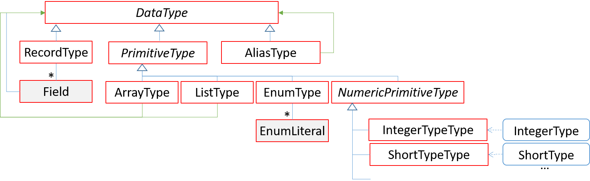

# oktoflow Configuration: Types

An oktoflow application configuration is based on types, predefined types as well as user-defined types. While *predefined types* provide a basis of primitive types, *user-defined* types (usually arrays, lists or records) characterize the data that is received from external sources via connectors, flowing through services of an application and is (usually) emitted to external sinks via connectors. Besides specifically defined types for a certain purpose, oktoflow also allows for *alias types*, i.e., types that become an own type entity with some specialized properties are refined.



## Primitive Types

As usual in programming or PLC approaches, we rely on a set of pre-defined types representing numbers or strings. The type hierarchy of the platform encompasses primitive, pre-defined types, in particular numeric types such as Integer, Short or the (length and sign-specific) types defined by OPC UA. In addition, the type hierarchy allows for user-defined types with pre-defined structure and semantics, e.g., arrays (referring to a DataType representing the container element type), e.g., lists (also referring to a DataType representing the container element type), or enumerations (enumerable names).

Basically, a datatype has a (unique display) name and an optional semantic id (akin to Asset Administration Shell). The name of a datatype may, but must not be related to any programming language. The mapping of type names to programming language types happens during code generation, akin the mapping of more detailed integer/float types to actually available implementation types.

The following primitive types are currently defined:

| IVML (variable) type name | Display name | Description |
| --- | --- | --- |
|IntegerType | Integer| usual 32 bit signed integer number as in programming languages |
|ShortType | Short| usual 16 bit signed integer number as in programming languages |
|LongType | Long | usual 64 bit signed integer number as in programming languages | 
|LongIndexType | LongIndex | Refinement of `LongType` to indicate database/time indexes | 
|ByteType | Byte| usual 8 bit signed integer number as in programming languages |
|StringType | String | for character strings |
|StringBase64Type | String Base64 | for Base64 encoded character strings |
|BooleanType | Boolean| usual true/false type |
|FloatType | Float| usual 32 bit signed floating point as in programming languages |
|DoubleType | Double| usual 64 bit signed floating point as in programming languages |
|ObjectType | Object | representing not further typed arbitrary objects |
|Integer16Type | Int16| 16 bit signed integer number as in OPC UA |
|Integer32Type | Int32 | 32 bit signed integer number as in OPC UA |
|Integer64Type | Int64 | 64 bit signed integer number as in OPC UA |
|SByteType | SByte | 8 bit signed integer number as in OPC UA|
|UnsignedInteger16Type | UnsignedInt16 | 16 bit unsigned integer as in OPC UA |
|UnsignedInteger32Type | UnsignedInt32 | 32 bit unsigned integer as in OPC UA |
|UnsignedInteger64Type | UnsignedInt64 | 64 bit unsigned integer as in OPC UA|
|ByteStringType | ByteString | A sequence of octets as in OPC UA. |
|DateTimeType | DateTime | Generic, system locale-dependent date/time format |
|IEC61131_3DateTimeType | IEC 61131-3 DateTime | date time in IEC 61131-3 format|

Using arrays/lists, the following convenience types for frequently used primitives are provided:

| IVML (variable) type name | Display name | Description |
| --- | --- | --- |
|ByteArrayType | byte[] | array of ByteType values |
|IntegerArrayType | int[] | array of IntegerType values |
|DoubleArrayType | double[] | array of DoubleType values |
|StringArrayType | String[] | array of StringType values |
|BooleanListType |BooleanListType | array of BooleanType values |
|IntegerListType |IntegerListType | array of IntegerType values |
|DoubleListType | DoubleListType | array of DoubleType values |
|StringListType |StringListType | array of StringType values |

Background:
- OPC UA in relation to usual underlying PLC approaches is considered highly relevant to oktoflow. However, we focused here in an agile manner on basic types that already occured in application models. The OPC UA model integration adds further, OPC UA relevant types. This meta-model extension must be imported explicitly while these types are available by default.
- The distinction of arrays and lists stems from typed programming languages like Java. We added both underlying generic types in particular to experiment with the respective data transport performance.
-  For technical reasons, as IVML can only link to and reuse variables. Thus, the types listed above are defined as a compound type in the meta-model (postfix TypeType, e.g., IntegerTypeType) and then defined as a variable of that compound type representing the actual primitive type (postfix Type, e.g., IntegerType). 
- It is important not to confuse the types that we discussed here, which were specifically defined for the purposes of an AI-enabled platform in the Industry 4.0/IIoT application area and the types that are defined by the underlying modeling language IVML. The types defined in the oktoflow meta-model define what kind of types are permissible for applications; this may be a subset, a superset or even a completely different type structure than provided by a programming language or even IVML (although shared basic types and re-used names make sense and is intended). The types defined by IVML can be viewed as meta-meta-types as they are pre-defined and used to, in turn, define the types of the configuration meta-model of the platform, which, in turn, are used to define the configuration model of a specific platform and its applications.

## Record Type and Field

The RecordType represents complex user-defined types consisting of typed fields that are typically passed among services in service meshes. An example in IVML is shown below. This example defines the record type `rec1` (more precisely in IVML terms, `rec1` as decision variable of type `RecordType`) by specifying the name of the data type (which may differ from the variable name, but must be unique within a model) as well as the individual named/typed fields of that record. While type names must be unique within the same configuration, field names must be unique within the very record type. 

```
RecordType rec1 = {
  name = "Rec1",
  fields = {
    Field {
      name = "intField",
      type = refBy(IntegerType)
    }, Field {
      name = "stringField",
      type = refBy(StringType)
    }
  }
};
```
A `RecordType` provides the following configuration attributes:

| Field | Description | Default |
| --- | --- | --- |
| name | Name of the field, must be unique within the model. |     |
| fields | Named, typed fields Optional semantic identifier (preferred ECLASS or AAS) characterizing the type. |  -  |
| refining | Optional reference to another `RecordType` used as basis for this type. Akin to object-orientation, fields of the parent type are implicitly defined for the actual type ("taken over"). |  -  |
| semanticId | Optional semantic identifier (preferred ECLASS or AAS) characterizing the type. |  -  |

In turn, `Field` instances may be equipped with more information as summarized below:

| Field | Description | Default |
| --- | --- | --- |
| name | Name of the field, must be unique within the owning `RecordType` and, if given, its refining parent types. |     |
| type | Type of the field, given as reference to the variable declaring the respective type. May be a built-in type, a user-defined array, list, enum, alias or record type. |     |
| description | Description of the field to be taken over into the generated classes/documentation. |     |
| optional | Is the data mandatory or may it be absent / ignored in case of failures. E.g., when the underlying data cannot be accessed in a connector, the access will fail for a mandatory field but not for an optional field. | False |
| readOnly | Read-only data is not written back to data sources represented by a connector. If possible, no setter methods/functions will be generated for read-only fields. | False |
| nullable | May the data contain **null** as a value. If true, potentially additional code must be generated to handle this case, which may impact performance. | False |
| cachingTime | Time in milliseconds a connector may cache the data without reading it again from the underlying data source. Negative values indicate that the field shall be always be cached. Pre-defined constants are CACHE_NONE (0 ms) and CACHE_ALWAYS (-1 ms). However, the current default value may be changed in the future, as in our demonstrators/applications usually dynamic data is represented and CACHE_NONE must be specified explicitly, e.g., for OPC UA connectors. | \-1 |
| semanticId | Optional semantic identifier (preferred ECLASS or AAS) characterizing the type, if not given, taken over from `type` if stated there. |  _type.semanticId_  |
| displayName | Optional display name for values represented by this field, e.g., on a dashboard. | "" |
| display | Optional setting on how to display the field on a dashboard (`TimeSeries`, `Gauge`, `BarChart`, `Table`) | - |
| displayRow | Optional reference to display row that shall display this field. If not given, field will occur in some default (top)-row of the dashboard. | - |
| displayPanel | Optional set of references to display panels that shall display this field. If not given, a field will be placed into it's own panel. If given, fields share the same panel, e.g., being displayed as multiple timeseries. | - |

Again, in turn, `Field` instances may specify a `DisplayRow` or a `DisplayPanel` with the following fields:

| Field | Description | Default |
| --- | --- | --- |
| name | Name of the row, must be unique for all `DisplayRow` instances. |     |
| displayName | Optional display name  for the row. |  ""   |

| Field | Description | Default |
| --- | --- | --- |
| name | Name of the panel, must be unique for all `DisplayPanel` instances. |     |
| displayName | Optional display name for the panel. |  ""   |
| displayRow | Optional reference to the display row that shall display this panel. If not given, the panel will occur in some default (top)-row of the dashboard. | - |
| logo | Resolvable file name in classpath or `resources/software` or `http://`/`https://` resource pointing a logo. Turns panel into a logo panel. | `null` |
| fit | How to fit panel image contents, akin to CSS `object-fit`, may be `DisplayPanelFit::None`, `DisplayPanelFit::Contains`, `DisplayPanelFit::Fill`, or `DisplayPanelFit::Cover` | `DisplayPanelFit::None` |

Although all display related fields are optional for usual `Field` instances in a `RecordType`, because an usual `Field` shall not be displayed on a dashboard, they partially become mandatory if a `Field` shall be displayed. The following example illustrates this:

```
    RecordType influxEnergyData = {
        name = "InfluxEnergyData",
        fields = {
            Field {
                name = "PowerConsumption",
                description = "PowerConsumption in mA",
                type = refBy(FloatType),
                cachingTime = CACHE_NONE,
                displayName = "Power Consumption",
                display = Display::TimeSeries,
                semanticId = "0173-1#05-AAA187#005", // ECLASS for mA
                displayRow = refBy(topRow)
            }        
        }
    };    
    
```

i.e., `display` and `semanticId` become mandatory for dashboarding fields, `displayName` and `displayRow` are still optional where, if not given, default values are assumed. If a `displayRow` is given, a display row must be defined (also in `AllTypes.ivml`)

```
    DisplayRow topRow = {
        name = "TopRow",
        displayName = "The most important data."  
    };
    
```

and declared as one of the intended display rows in the application (e.g., `displayRows = {refBy(topRow), refBy(otherRow)}`).


Background:
- Type and record names are used for naming generated classes or attributes/fields as well as related methods/functions within the classes. Thereby, given names are adjusted to the respective programming language conventions, e.g., Java or Python. However, within data formats, e.g., JSON, we keep the original names as specified in the model.

## Alias Type

Alias types consitute an own type that is essentially based on an existing type while giving this type a new name or refining certain properties. For example, for energy applications it makes sense to define the unit Ampere could as an alias of a double floating point number. 

```
AliasType AmpereType = {
    name = "Ampere",
    represents = refBy(DoubleType),
    semanticId = "0173-1#05-AAA220#005"
}
```

| Field | Description | Default |
| --- | --- | --- |
| name | The unique name of the type | |
| represents | Reference to the type variable that shall be aliased | |
| semanticId | Optional semantic id detailing the type | _represents.semanticId_ | |

Let us assume that similarly an `AliasType` called `MilliAmpereType` has been defined. Then, in the example `influxEnergyData` type above, the `type = refBy(FloatType)` can be replaced by `type = refBy(MilliAmpereType)` and the `semanticId` can be left out there as it has been already defined on `MilliAmpereType`.