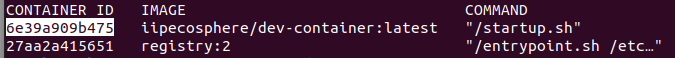
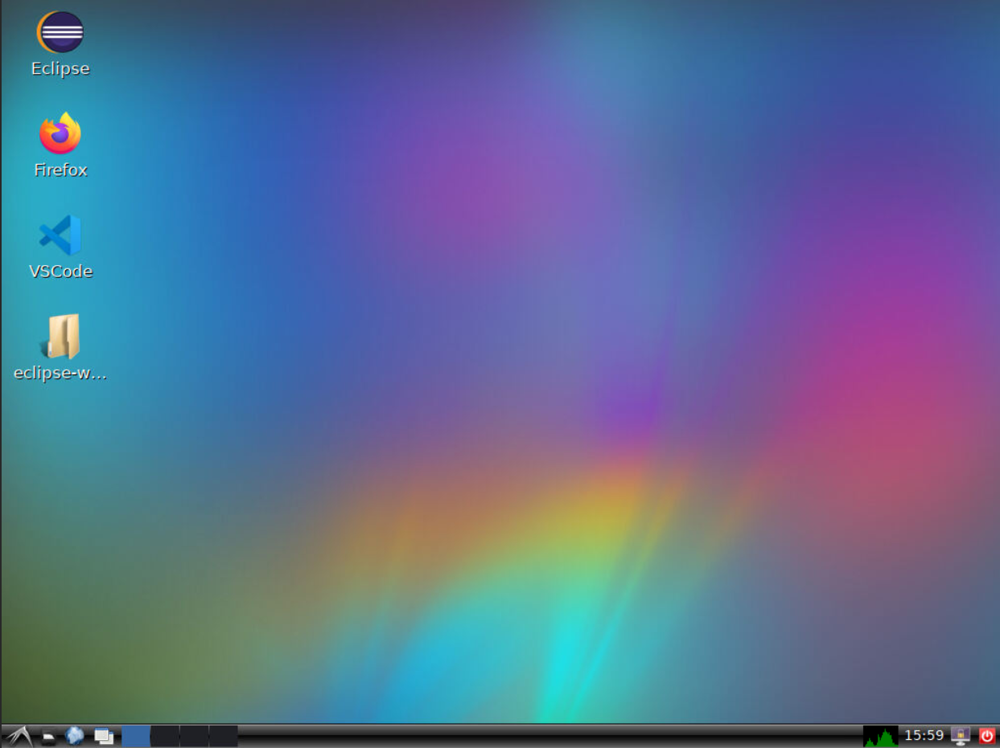
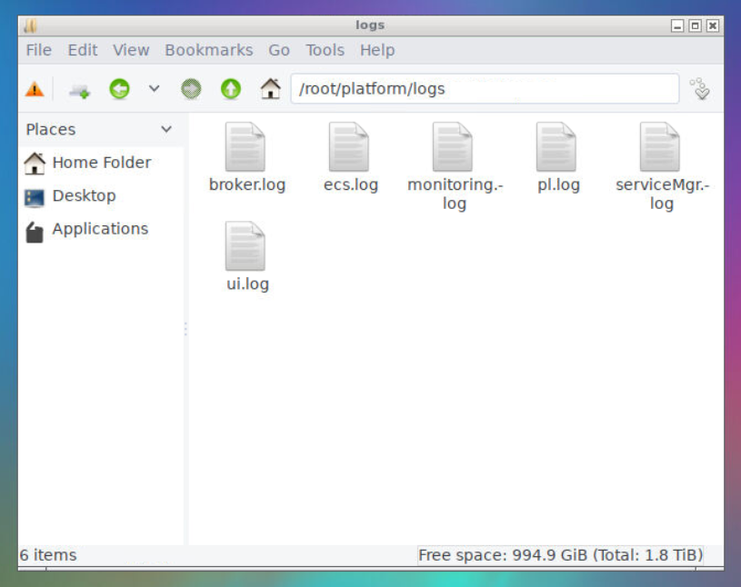
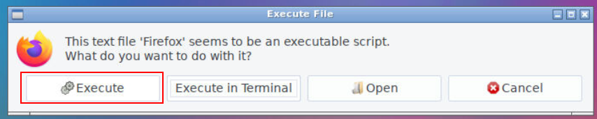
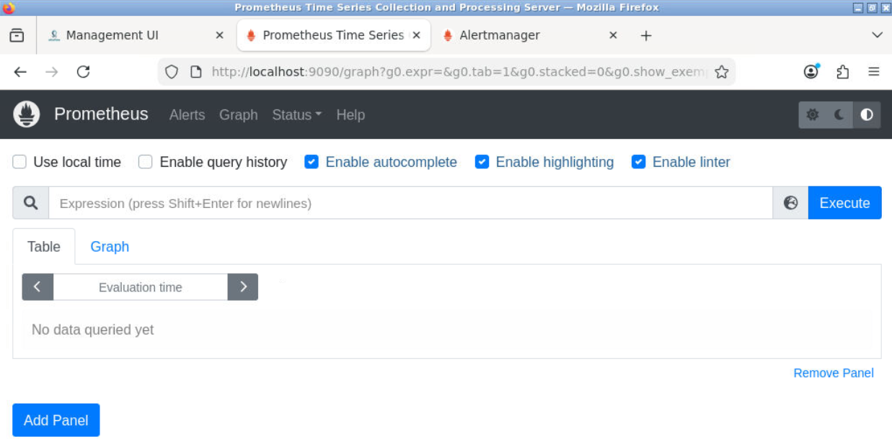

# Development Container

The Development Container is a Docker container available on [DockerHub](https://hub.docker.com/r/iipecosphere/dev-container). It contains a Linux machine that can be accessed and used through your browser. Inside, the container includes the **platform** and an **application template**.

## Getting started
> **Note:** We assume you have Docker installed on your machine. You can check with  `docker ps`.

Pull the latest image from DockerHub:

    docker pull iipecosphere/dev-container:latest

> The image is quite large — approximately 2 GB.

Start the container with: 

    docker run -p 6080:80 -v /dev/shm:/dev/shm iipecosphere/dev-container:latest
 
On your host machine, the development container is now available at  **`localhost:6080`** (open this in your browser).

### Keeping changes (persistency)
To preserve your changes inside the container, it must be properly stopped after the first start. First, check the container ID with:

    docker ps

    docker stop <CONTAINER ID>

For example:

    docker stop 6e39a909b475

To restart the container, simply run:

    docker start <CONTAINER ID>

To restart the container and attach to its console output, use:

    docker start -i <CONTAINER ID>

## Inside the container

	
The container provides a full Linux desktop environment accessible via the browser.

### IDEs
The development container includes two integrated development environments:

- **Eclipse** with Java, Python and EASy editor
- **VSCode** with a Python extension

### Platform 
When the container starts, the components such as the platform, ECS, Service Manager, Monitoring, and Management UI are started automatically. Log files are written to `/root/platform/logs/`

### Management UI
Inside the container, open the Internet browser and click **Execute**

The Management UI is available at: **`localhost:4200`**.

### Monitoring

Monitoring services are accessible at: `localhost:9090` and `localhost:9091`.

> **Note:** Booting all components may take a few seconds. If services are not immediately available, refresh the page after a short wait. 

**Enjoy! :)**
