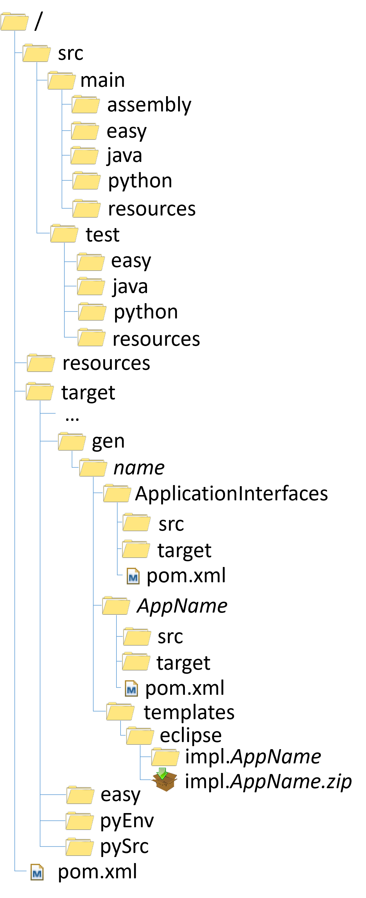
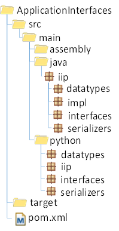
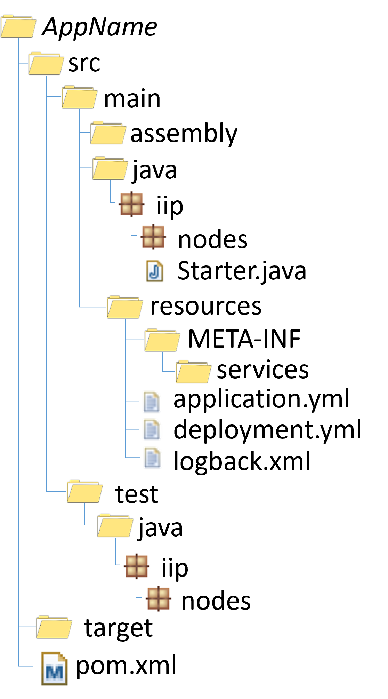
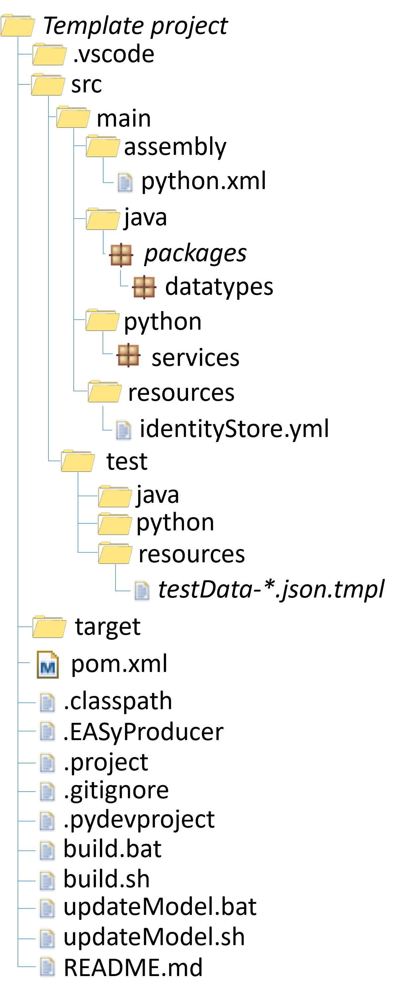

# oktoflow platform: Project structures

Due to the Maven build process and the generation of code during the instantiation, the service implementation creates/assumes a certain project structure. As creating structures across multiple programming languages may be challenging, we generate *application code templates*  that follow the strutural rules containing code skeletons.

## All-in-one project structure

The figure above illustrates the overall structure of an all-in-one implementation project as we use it for most of the platform examples. If is a Maven project structure with additional folders and files. On top-level, it consists of two folders, 
- a folder for the sources (`src`), which contains your code that relies on platform code and generated code. 
  - `main` contains production code, i.e., parts that shall be processed and packaged into the production artifact of the application.
    - `assembly` contains project-specific Maven packaging descriptors, e.g., for Python. These assembly descriptors are executed from the main `pom.xml` of the project, i.e., if you need further assembly descriptors, e.g., for packaging AI models for multiple services in individual re-usable assets, you must create and hook them into manually.
    - `java` contains production Java code
    - `python` contains production Python code, usually located in the `services` module folder. `src/main/python` may not exist if your app does not need Python.
    - `easy` contains the configuration model of the application 
    - `resources` contains resources that are required by the application and shall be packaged and deployed with the application's JAR file.
  - The `test` tree contains testing code, e.g., unit tests.
    - `java` the unit tests for Java that are executed dynamically by the build process.
    - `python` the unit tests for Python that are executed dynamically by the build process. `src/test/python` may not exist if your app does not need Python.
    - `resources` contains resources that are required for test execution.
- `resources` folder containing resources that shall be packaged on top-level of the application artifact, i.e. not as `src/main/resources` into the nested application`s JAR. Depending on used binary services there might be more folders.
  - `software` resources for the respective application, e.g., the identity store, images, mocking test data required to run the application standalone.
  - `devices` resources for devices, such as nameplates, images, AASX. Usually this folder does not exist only in platform projects, not in in application projects.
  - `platform` resources for platform services. Usually this folder does not exist only in platform projects, not in in application projects.
- `resources.ipr` optional mirror folder of `resources` containing files and binaries under IPR licenses. This folder must not be committed into a (public) source repository.  
- the `target` folder containing the created/compiled binaries. Initially, the `target` folder may not exist as it is created and filled during the instantiation/build process of the project. To a large degree, the `target` folder contains binary files that are created during the build process and, thus, this folder is usually not committed into a source code repository. This may lead to the effect that after an initial checkout, certain files in `target` are not in place, i.e., your IDE may show errors. After executing the build process and thereby the instantiation/code generation as well as updating your implementation project, these errors usually disappear. 
  - `gen` contains all files generated during application/platform instantiation, nested within a folder named as specified in the build process.
    - `ApplicationInterfaces` contains a generated nested Maven project which defines the application interfaces for the used programming languages as well as it's own build process. This folder is created and the build process is executed during `genInterfaces` from the top-level `pom.xml`.
    - One folder per configured application containing the application glue code integrating your services as well as the assembled application artifacts/binaries. This folder is created and the build process is executed during `genApps` or `genAppsNoDeps` from the top-level `pom.xml`.
  - `easy` contains the oktoflow configuration metamodel. During the first run of the build process, the metamodel is obtained from maven and unpacked.
  - `pyEnv` contains the source code of the Python service environment. During the first run of the build process, the Python service environment is obtained from maven and unpacked here so that your IDE can use them (in `PYTHONPATH`) to support coding..
  - `pySrc` contains the source code of the generated Python service interfaces. These interfaces are generated by the application instantatiation during a run of the build process, deployed into a local Maven repository, obtained and unpacked here so that your IDE can use them (in `PYTHONPATH`) to support coding.

In addition, on top-level there is the Maven build specification (`pom.xml`), the `.gitignore` file as well as IDE specific files, e.g., `.project`, `.classpath` or `.pydevproject` for Eclipse. There may be further files, e.g., for the integration into a CI environment or shell scripts supporting the execution of the build process.

After the first run of the build process/app instantiation, the `target/gen` folder consists of three sub-folders.

### ApplicationInterfaces folder structure

As illustrated above, the `ApplicationInterfaces` is a usual Maven project, i.e., simplified compared to all-in-one projects. As usual in Maven, the `src` folder contains `main` for production and `test` for test code (here optional, the interface artifacts so far has no generated tests), with sub-folders `java` for Java code, `assembly` for optional assembly descriptors and `python` for optional Python code. The main project folder contains the Maven build specification `pom.xml`.

Within the `java` folder, there are four Java packages (in the `iip` package, still due to the origin of IIP-Ecosphere):
 - `datatypes` with the generated data type classes and (enabled by default) the data type interfaces
 - `serializers` the generated data type serializers for the configured wire format
 - `interfaces` the service interfaces as basis for implementing configured application services
 - `impl` the service basic implementation classes based on the `interfaces`, allowing for a more convenient implementation of services as, e.g., required data ingestors or service parameter handling is already present

The `python` folder contains corresponding Python classes in equally named modules. Python data classes care for the implicit translation of numpy instances as these cannot be serialized. Further, Python data type serializers care for the oktoflow Java-Python field naming scheme as well as for nested data types. 

The Maven artifact id of this project is typically `ApplicationInterfaces`, the the Maven group id as well as the versiobn are determined by the platform configuration. However, in certain cases it makes sense to modify the group id, e.g., for all-in-one examples as they contain a full (usually unused) platform configuration and, if not changes, would collide or accidentally override the application interfaces of an installed platform or of other all-in-one examples.

For downloading the `ApplicationInterfaces` via the management UI, the `ApplicationInterfaces` project, the platform instantiation packages the project as ZIP and stores it in the `target/gen`. 

## Application folder structure

The second kind of folder contains an integrated application as Maven project, i.e., for each configured application in a platform configuration a folder named according to the respective application is created. The folder contains the integration of the employed services/connectors into the service execution engine, the representation of the data flows as well as service engine specific testing code. The classes in this generated Maven project also rely on `ApplicationInterfaces` as well as on your (integrated) service code. The typical structure is again a Maven project as illustrated below:

As Python code is integrated through platform Java classes and an oktoflow app is a Java/Spring application, the project is more or less a pure Java project. In `src/main` it contains of
  - `assembly` containing specialized assembly descriptors, usually for obtaining Python Maven artifacts and re-packaging them into the application
  - `java` mainly implementing the generated binding of services/connectors into the respective service execution engine, by default Spring Cloud Stream. Further, there is the `Starter.java` class, which refines a pre-defined starter class from the respective service environment, in particular to register the data serializers generated/implemented in `ApplicationInterfaces`.
  - `resources` containing the application startup specification (`application.yml`) for Spring as well as the service deployment descriptor (`deployment.yml`) read by the platform for managing the contained services. There may be a logging configuration (e.g., `logback.xml`) and, if Java Service Loader (JSL) descriptors are needed to hook certain functionality into the platform also descriptor files in `META-INF/services`.
In `src/test` there are generated test classes, in particular a service-level test for each service utilized by the application. In contrast to basic unit tests (see application code template below), the service level tests set up an enviroment as the platform would do when starting the application, i.e., resources are prepared and loaded as during an application start. These tests (to be started manually via `mvn exec:java`) are intended to figure out whether the service packaging is correct and the service will behave as expected in the service environment, e.g., whether the service implementation is unpacked correctly (Python, platform-supplied binary services like KODEX or RTSA) and whether resources are loaded correctly from relative paths or via the platform `ResourceLoader`.

## Application code template

The third directory `templates` contains the generated application/service code templates. 

This folder contains one Maven project per supported IDE (currently only Eclipse with additional files for VSCode) and within such a folde the template sources to support the implementation of application service. The contents of a project folder is packaged into a ZIP by the application instantiation process to make it availble for download through the management UI. The project contains

  - `.vscode` experimental folder to facilitate the integration of the platform Python sources (located in `target/pySrc` and `target/pyEnv`) into VSCode.
  - `src/main` containing the production (skeleton) code of the app. Although the code compiles it usually does not contain required functional parts as they are not covered by oktoflow's metamodel.
    - `assembly` suggested (optional) service assembly descriptors, in particular for Python services
    - `java` Java source code skeletons, placed in the package hierarchy as stated as fully qualified names in the configured Java services
    - `python` Python source code skeletons if Python services are configured, placed in the default module `services` (can be adjusted in the configuration of individual Python services)
    - `resources` required files to execute the services, e.g., the identity store using default values. If an app is based on a configured application template, the identity store is generated from the app configuration model.
  - `src/test` includes the suggested service-level unit tests
    - `resources` contains templates for input data according to the configured `RecordType` types of the application. To make tests effective, these files (just containing an explanation of the respective file structure) shall be filled with test-relevant data (potentially including ingestion periods and repetition counts). Usually the files consist of JSON data points, each data point in an own line, i.e., there is no surrounding JSON sequence.
    - `java` contains corresponding junit tests for Java services reading input data from corresponding data files `resources`. Besides service testing code, the folder also contains the package `iip.connectivity` where connector connectivity tests are located. Connector connectivity tests shall be executed as early as possible, potentially even before service tests, to figure out whether the intended input via connectors is possible at all. For this purpose, the application instantiation generates for each connector instace a test program, which emits the data structure accessible to the connector (if available) and obtains/prints actual data from the data source via the connector. For setting up a connector instance, the technical information from the configuration model is used, i.e., network address, port, authentication key or security information must be correct to successfully establish a connection. 
    - `python` contains corresponding unit tests for Python services reading input data from corresponding data files `resources`.

The root folder of the project contains various files for IDEs and git, in particular for Eclipse (`.classpath`, `.EASyProducer`, `.project`, `.pydevproject`), for git (`.gitignore`), the Mavem build process (`pom.xml`) and shell script wrappers to ease calling the build process (`build.bat`, `build.sh`) and for updating oktoflow's metamodel stored in `target/easy` (`updateModel.bat`, `updateModel.sh`).

As the platform/application instantiation process is not allowed to touch your code. In particular, when data types or services are added/removed in the application configuration, application interfaces may change. After such modifications, your code may break and may need manual adjustments. But also new data types and services are not automatically taken over. Thus, it makes sense after such modifications, to carefully compare the own service implementation project with the files in the application code templates, including code skeletons, unit tests and test input data files. 