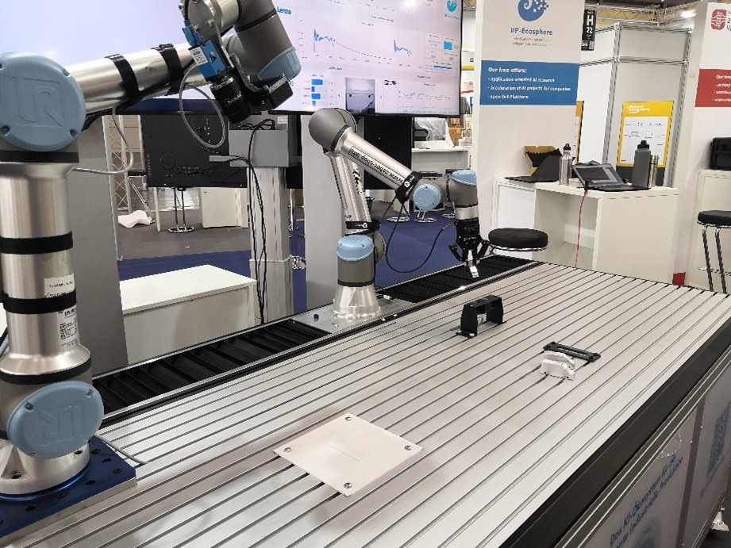

# oktoflow platform: Example applications

In this section we summarize several applications that have been built with oktoflow. Besides the specific applications used as regression test cases for [configuration.easy](../../configuration/configuration.easy) such as `SimpleMesh`, `SimpleMesh3` or `RoutingTest`, which are rather artificial, there are several more realistic examples.

It is important to mention that the **examples must be processed by the platform instantiation**. In other words, when you import and open one of the examples the first time in an Integrated Development Environment, you may run into compile errors or missing dependencies. These are (usually) not bugs, rather than parts that were intentionally not committed and that must be created using the platform instantiation process. After a [platform installation](../INSTALL.MD), this can be achieved by running `mvn install` (obtains meta model and Python libraries, performs code generation, usually runs the application in a test case) in the local directory of the respective example. See the [build commands](../BUILDING.MD) for more details, e.g., on how to update the metamodel.

Further, most examples are realized in **all-in-one style**, i.e., for convenience they contain the platform/application in the same project as the service implementation. If applications are specified through the management UI, the platform manages the configuration model, i.e. you can download an application code template (not including the configuration model), fill missing code, test the services and hand back the code to oktoflow for application integration.

Each of the examples discussed below includes a README.md file with more detailed explanations. 

## Complete Examples

### [examples.python](../../examples/examples.python)

This example focuses on the integration of an asynchronous service realized in Python and demonstrates the Python service operating in asynchronous fashion in a data flow starting at a simple Java data source and ending in a simple Java data sink. The data flow is realized with AMQP as transport protocol. 

### [examples.pythonSync](../../examples/examples.python)

This example follows a similar setup as _examples.python_, but integrates the Python service in synchronous manner service passing its data on to a synchronous sink.

### [examples.pythonCondaVenv](../../examples/examples.pythonCondaVenv)

This example follows a similar setup as _examples.python_, but uses virtual Python environments and two different Python installations.

### [examples.rtsa](../../examples/examples.rtsa)

This example shows how to utilize the RapidMiner Real Time Scoring Agent (RTSA) as platform-supplied service in an application. The example is rather similar to _examples.python_, except for the use of RTSA instead of a Python service. However, RTSA is commercial software and cannot be not included in the example or the platform. For demonstration, we use the  simple FakeRTSA from the platform regression tests. 

### [examples.KODEX](../../examples/examples.KODEX)

This example illustrates how to use KIPROTECT Kodex as anonymization/pseudonymization service in an application. Also the structure of this example is rather similar to _examples.python_. One specific aspect is that Kodex is a generic platform-provided service that needs to be customized for the use in an application. This configuration happens automatically based on information provided in the application configuration. A further aspect is that this example integrates an in-memory database as data sink through a manually implemented service. 

### [examples.templates](../../examples/examples.templates)

This example separates platform/application configuration from service implementation. Structurally, the example structurally is similar to _examples.python_ and utilizes a simple Python service. The example consists of two parts, the `examples.templates.model` and the `examples.templates.impl`. The model part is based on the [impl.model project](../../tools/impl.model). The `examples.templates.impl` is created by importing the application code template generated by the build process of `exmples.templates.model` complemented by the implementation of the service functionality. The services implemented in `examples.templates.impl`  are made available by running `mvn install` there. The application is completely build by then running `mvn install` in `exmples.templates.model`. The result is an application that takes data from the `resource` directory and evaluates it utilizing a Python service with a pre-trained random forest classifier.

### [examples.hm22](https://github.com/iip-ecosphere/examples/tree/main/examples.hm22)

This example was developed by the IIP-Ecosphere project partners for the Hannover Messe 2022 (HM’22) and, in an improved version, for the Tage der Digitalen Technologie in Berlin (TddT’22). The example involves IIoT/Factory hardware like cobots and edge devices. 

The application demonstrates a visual AI-based quality inspection process for a configurable lot 1 production, where a robot with mounted camera takes pictures from three sides of an aluminum car model. A QR code on the indicates an external AAS describing the configuration of the car. The two other pictures are utilized by a Python-based AI to detect the number of windows, the color of the tires, the presence of an engraving as well as whether “scratches” were accidentally caused on the surface of the car. The services, in particular the AI, can be executed in different deployment settings, e.g., on a Phoenix Contact AXC 3152 PLC/edge device. For this purpose, the application consists of two generated connectors (OPC UA to obtain input from the PLC, AAS to request information on the car configuration), a camera source, the AI (as service family to switch between alternative AI implementations), the action decider (controlling the overall process) as well as a customized version of the generic, platform-provided `TraceToAAS` service. The application involves forward data flows as well as backward data flows for controlling the process, i.e., signaling among the services. The figure below illustrates the physical setup. 

### [examples.emo23](https://github.com/iip-ecosphere/examples/tree/main/examples.emo23)

This example is an evolution of _examples.hm22_ to demonstrate a federated learning showcase on Hannover Fair 2023 and, in an improved version, the Days of Computer Science 2023 in Hildesheim as well as for Nürnberg Digital 2023. The demonstrator showcased the application of a platform-generated federated learning service with two cobots representing two distinct factories. One cobot learned anomalies from the other without having seen them before. 

For the final public exhibition of the IIP-Ecosphere project at EMO’23, the Hannover Fair 2023 demonstrator has been extended towards a visual quality inspection process of two collaborating cobots. One cobot graps a model of the car and identifies it through a sensor provided by MIP technology (AI-enhanced sensor reading, finally leading to the retrieval of the respective car AAS). After successful identification, the whole cobot still gripping the car is moved by a Lenze linear drive close to the other cobot, thus overlapping the safty perimeters of both cobots. There, the model car is placed and the linear drive moves the identification cobot back to its original position. On the forward way, obstacles like friction and tension can be applied to the drive to be detected by a condition monitoring AI service. The second cobot then performs the quality detection as done in the examples.hm22 application.

## Experimental/Validation examples

### [examples.vdw](../../examples/examples.vdw)

This example focuses on the OPC UA connector using data in form of the OPC UA companion specs in collaboration with the Verein deutscher Werkzeugmaschinenhersteller (VDW) and the UMATI initiative. VDW offers a test server providing model instances according to OPC UA companion specs. This example contains a generated connector based on an automatically derived IVML model as well as a handcrafted connector for comparions. It is important to mention that the example does not read the whole UMATI test server structure, rather than a small piece of  the OPC UA Woodworking Companion Spec. The example represents the respective part of the Companion Spec in terms of IVML, imports the structure into the configuration model, adds some information about caching and server coordinates and creates a simple application mesh that just consists of a source (the connector), i.e., no further processing with the obtained information happens here (and some of the generated artifacts may be unusually empty). 

### [examples.modbusTcp](../../examples/examples.modbusTcp)

Regression test example for the MODBUS/TCP connector. Contains a simple application, as in _examples.VDW_ for completeness of the configuration model. Also this example contains a generated and a handcrafted connector. The application is not used, rather than the connector is tested directly.

### [examples.rest](../../examples/examples.rest)

Regression test example for the REST connector. As _examples.VDW_ and _examples.modbusTcp_ it consists of a simple application for completeness of the configuration model. The application is not used, rather than the connector is tested directly.

### [examples.MIP](../../examples/examples.MIP)

Demonstration of the metamodel extension for MIP technologies as applied in _examples.emo23_. The metamodel extension encompasses a customized MQTT connector and related data types pre-defined in the oktoflow's configuration library. The example illustrates a data ping-pong between the MQTT connector and a Python AI service to improve magnetic identification measurements utilizing a Python AI (non-included). The sensor software pushes data to an MQTT broker, which is taken up by the connector, improved by the AI, passed back to the sensor software, validated and approved by the sensor software, pushed again and bypassed by the Python AI to a downstream application. The example cannot be executed without the respective hardware of MIP technologies.

## Conceptual examples

### [examples.MDZH](../../examples/examples.MDZH)

Conceptual example for an energy demonstrator in the Mittelstands Digital Zentrum Hannover. Includes OPC UA, AAS, serial and INFLUX connector. The example does not process data.
