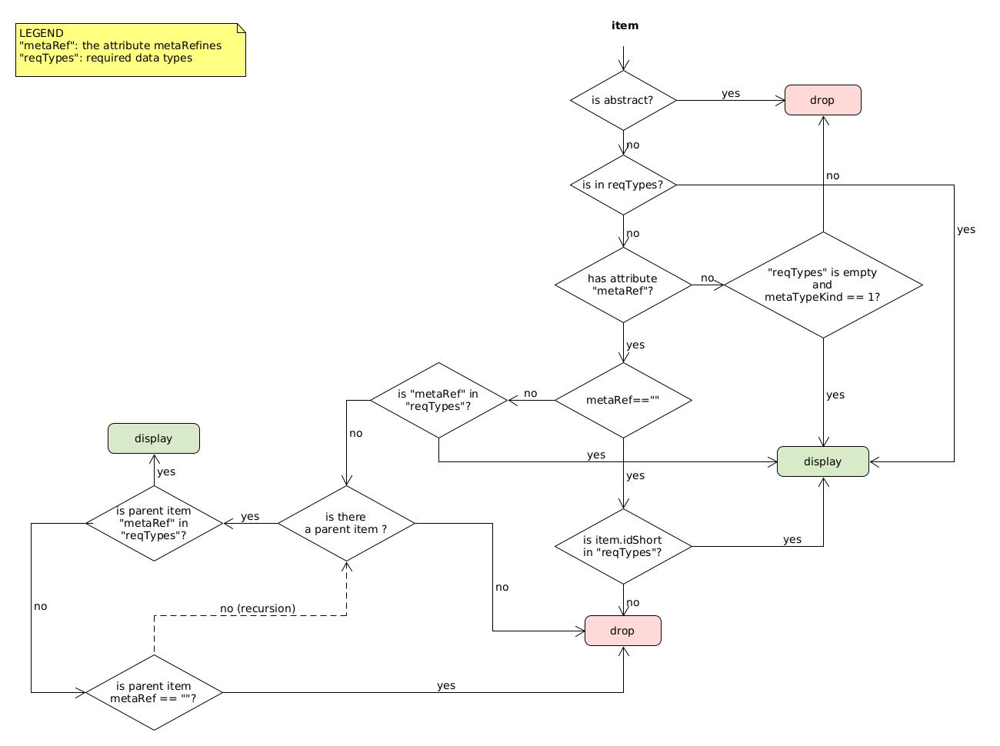

# oktoflow platform: Management UI

## Prerequisites (for Ubuntu Server, CI)

- install node.js and node package manager (npm)
- install Angular CLI

Node.js, npm and angular versions, see [platform prerequisites](../documentation/PREREQUISITES.md). Please see also (Angular version compatibility matrix)[https://angular.io/guide/versions].
During the upgrade to Angular 19, some components did not complain for incompatibilties, i.e., it might be that ``npm install --force`` is requried.

## Running Management UI from Code

- install dependencies: change directory to /managementUi and run `npm install`
- environment variables: change directory to /managementUi/src/assets/config and edit config.json. Change ip to the platform ip that the UI is supposed to connect to
- serve managementUI: change directory to /managementUi and `run ng serve`

## Building the Management UI

Handled now through `mvn compile`. On the first try, we recommend running the following two steps manually
  - `npm install` 
  - `ng build` 
  - `ng test` 

## Setting up the Management UI

An installed management UI contains a setup JSON file in `assets/config/config.json`, which is created/modified during platform instantiation based on the UI configuration in the configuration model. Currently, an example looks as follows

    {
        "ip": "http://192.168.0.199:9001",
        "urn": "urn%3A%3A%3AAAS%3A%3A%3AiipEcosphere%23"
    }
    
whereby the `ip` points to the platform AAS server and the the `urn` denotes the URN of the platform AAS.

## Running the test suite

The full test suite requires a running platform instance. This is automatically set up when running `mvn install`, as usual with `-Dunpack.force=true` to update the models or `-Dconfiguration.force` to rebuild the platform.

## Developing with the test suite

Repeatedly running the full test suite with platform setup may be time consuming. You may split up the two parts, running the platform instance and running the test suite so that you can keep the platform instance running an execute the tests on demand. However, you have to decide for either one until explicitly switching back. If you want to build the platform for developing against it, call

`mvn generate-test-sources -Dconfiguration.textFile.disabled="full" -Dunpack.force=true` 

This obtains the most recent components, instantiates the platform and updates the configuration meta-model as well as the configuration used for testing.

And in separate shells (exemplified for Linux, use `.bat` extensions and backslashes in paths for Windows)

- `cd gen/broker/broker`
- `./broker.sh`

as well as

- `cd gen/platform`
- `./platform.sh`

as well as

- `cd gen/platform`
- `./ecsServiceMgr.sh --iip.id=local`

Ensure that the temporary file `src/test/tmp/config.json` does not exist (must be in `src` due to Angular conventions), i.e., delete it if it exist, and run then

`ng serve` in the project folder of the management UI.

If you also need a running application (all tests shall be developed so that executing an application is optional although decreasing the test coverage), please execute in an own shell

- `cd gen/platform`
- `cli.sh deploy artifacts/deployment.yaml`

`ng test` or for more "headless" execution
`ng test --no-watch --no-progress --browsers=ChromeHeadless` if desirable also with `--code-coverage` or further arguments.

For shutdown of the running application, consider executing `cli.sh undeploy artifacts/deployment.yaml` or an undeployment via the UI.

When re-building/re-instantiating the platform, e.g., after functional or model changes, please ensure that all running platform instances started above are stopped (`CTRL-C` in each of the shells) and run then the maven command from the beginning of this section.

To re-enable and execute the full tests, run `mvn install -Dunpack.force=true`.

## Development hints

Use `console.debug`, `console.warn`, `console.info`, `console.log`, `console.error` where appropriate, not only `console.log`. Except for `console.error`, the others can be switched off via `assets/config/config.json`. 

## Material Icons (Styleguide)

Use the colors from the (internal) oktoflow styleguide as defined in ``styles.scss``, if needed lighter variations or basic grey variants, white or black.

* Save/Create/New: ``done``
* Close/Cancel: ``close``
* Expand: ``expand_more``
* Collapse: ``expand_less``
* Done/Ok: ``check``
* Add: ``add``
* Edit: ``menu_open``
* Upload: ``upload`` 
* Generate app: ``flight_takeoff``
* Code/generate template: ``code``
* Delete: ``delete``
* Shift left: ``keyboard_arrow_left``
* Shift left: ``keyboard_arrow_right``
* Deploy: ``start``
* Undeploy: ``delete``

For more material icons, see [Google Fonts Icons](https://fonts.google.com/icons).

## Upgrading Angular

* Install the required NodeJS/Angular version, see [Angular compatibility matrix](https://angular.dev/reference/versions).
* Set environment variable ``NODEJS_HOME`` to the home directory of the new NodeJS installation.
* Run the respective Angular update procedure, see [Updating Angular](https://angular.dev/update-guide) with material enabled.
* Build and test the management UI using ``mvn install`` (see above). It might be needed to delete ``gen`` and ``target/gen`` folders before.
* Build the management for development, run the individual processes (see above) and check the individual parts for their operation.

On Windows, it might be necessary to open new cmd shells as it might cache some executables like `ng`. In particular on the CI, it may be needed to delete ``node_modules`` and `.angular/cache`.

## TODO

* Delete meshes.
* Input ref select default values for nameplate.
* Offline icons
* Generated variable names (backend API call)
* Logging output

## Further details

Configuration model filtering process:
