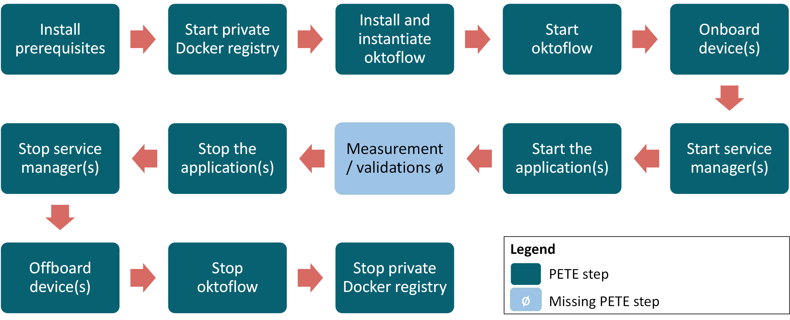

# IIP-Ecosphere platform: distributed test and evaluation environment

Python-based environment to test and evaluate the platform and applications running on the platform in distributed, automated fashion.

We selected Jupyter Project to realize the workbench idea. We created a shell(Linux)/batch(Windows) scripts to automate the installation, testing, and evaluating of the platform and the applications. We created Python scripts in Jupyter to manage the test and run the shell(Linux)/batch(Windows) scripts. 

We created Python scripts in Jupyter Notebook to manage tests. The Python scripts generate command scripts either shell (Linux) or batch (Windows) based on the operating system of the machine that runs the Jupyter Notebook. The generated command scripts execute the actual scripts remotely to interact with the server and devices. Those scripts are shell (Linux) or batch (Windows) based on the operating system of the server and devices. Those scripts are executed remotely to do different actions like installing the prerequisites, Starting a private Docker registry etc. 

## Procedure



1.  Install the prerequisites:  the required setup needed for the platform on the server and devices that should be used for the test.
    1.  Server setup includes Java, Maven, Docker, and Python with basic dependencies. 
    1.  Devices setup: If the device will use the generated containers, then the setup includes just Docker. If the device will use normal scripts, then the setup includes Java, Maven, Docker, and Python with basic dependencies. 
1.  Starting a local Docker registry: pull and run the registry container, then setup the local Docker registry to not use certificates (as mentioned in Section 8.6).
1.  Install and Instantiate the platform:
    1.  For the server, it is a full installation of the platform with creating the artifacts and containers for the applications and then adding the containers to the local Docker registry.
    1.  For the device, setup Docker to use the local Docker registry to pull images (specify that no certificate needed for pulling images from the local Docker registry).
1.  Start the platform: run the platform scripts on the server (broker.sh, platform.sh, mgtUi.sh, and monitoring.sh).
1.  Onboard (join) devices:
    1.  Using the generated containers: pulls the respective ECS container from the local Docker registry and runs it on the device to join the platform.
    1.  The local installation way using scripts: download and run the respective scripts on the device to join the platform (`broker.sh`, `ecs.sh`, and `serviceMgr.sh`).
1.  Start service manager: if the device uses the generated containers then run the respective service manager container.
1.  Start the application:
    1.  By services functionality in the platform.
    1.  By deployment plan functionality in the platform.
1.  Measurement and validations (_not yet implemented_).
1.  Stop the applications.
1. Stop service managers: if the device uses the generated containers then stop and remove the respective service manager container.
1. Offboard (Remove) devices:
    1.  Using the generated containers: Stop and remove the respective ECS container on the device.
    1.  The local installation way using scripts: Stop the respective scripts on the device (`broker.sh`, `ecs.sh`, and `serviceMgr.sh`).
1. Stop the platform: Stop the platform scripts on the server (broker.sh, platform.sh, mgtUi.sh, and monitoring.sh).
1. Stop the local Docker registry: Stop and remove the registry container.

We are using Python scripts developed in Jupyter Notebook to manage tests. The Python scripts generate command scripts either shell- (Linux) or batch- (Windows) based on the operating system of the machine that runs the Jupyter Notebook, this machine that runs the Jupyter Notebook is called the TestManager. The generated command scripts execute the actual scripts remotely to interact with the server and devices. Those scripts are executed remotely to do different actions like installing the prerequisites, starting a local Docker registry etc. 

## Setup

The folders and files in the testing environment:
  * `Setup`: A file (`TestSetup.yaml`) used to manage the testing environment, the available and usable machines/devices, the platform, the applications to execute, and the tests and their properties (e.g., repetitions, testing/evaluation time, etc.). 
  * `Scripts`: A folder that holds the shell (Linux) or batch (Windows) scripts that perform the actual execution of the testing/evaluation process on the involved machines. There are two types of scripts - Server and Device scripts - based on the respective role of the machine in the test. Those scripts are moved automatically to the machines that are included in the test based on the role of the machine.
  * `Commands`: A folder that holds scripts generated by Jupyter Python Notebook, those commands are generated based on the operating system of the machine that runs the Jupyter Notebook. Those commands executed remotely the scripts moved to the machines. 
  * A Jupyter Python Notebook (`TestManagementScript.ipynb`) that reads the `TestSetup.yaml` setup file then creates and runs the commands which in turn executed remotely the scripts that moved the machines.
  * `Logs`: a folder that holds all the logs from running the commands and scripts.
  * `AllLogs`: a folder that holds the logs from the previous running of the test named by the date and time of the test.
  * `RunTheTest.sh`: a script that run the test in headless execution (Without Jupyter Notebook):
    * Convert Jupyter Python Notebook to Python script.
    * Extract the number of repetitions of the test from `TestSetup.yaml` setup file and repeat the test as exist in `TestSetup.yaml` setup file.
    * Move the current logs from `Logs` folder to `AllLogs` folder and give it name (the date and time of the test)
  
`VMsSetup.yaml` structure:
  * `TestRun`: The general setup for the number of repetitions of the test.
    * `Repetition`: The number of repetitions of the test to be executed.
  * `Setup`: The general setup for the test and testing environment.
    * `TestMgrOS`: The Operating System for the machines that runs the testing environment. 
    * `MoveScripts`: Move the shell(Linux)/batch(Windows) scripts to the devices either Server or Device scripts - Jupyter Step "Move The Files".
    * `InstallPrerequisite`: Install the prerequisite application with the respective version (Java , Maven, Python, docker) - Jupyter Step "Install The Prerequisite for The Platform"
    * `EcsSvcMgrContainers`: In case of creating containers for the Ecs and Service Manager we should use the respective container type, check the handbook for more information.
    
        1. `Non`: No containers creation
                
        2. `Ecs_Svc_App`: 1 - one container: ecs + svc + app
        
        3. `EcsSvc_App`: 2 - one container: ecsSvc + app
        
        4. `C1Ecs_C2Svc_App`: 3 - 1st container: ecs, 2nd container: svc + app
        
    * `RunDockerRegistry`: Run docker private registry on the machines - Jupyter Step "Run Docker Registry".
    * `DockerRegistry`: The IP address and port for the private docker registry.
    * `DockerRegistryPort`: The port for the private docker registry.
    * `ArtifactsFolder`: The directory for the generated artifacts by the platform instantiation. 
    * `MgtUiServerIP`: The IP address of the management UI server.
    * `LocalBrokerPort`: Optional local port for the brokers in the devices and containers. 
    * `CleanAll`: Clean Maven local repository and the ArtifactsFolder - Jupyter Step "Clean Maven and Artifacts Folder".
    * `InstallPlatform`: Install the platform and instantiates it - Jupyter Step "Install The Platform".
    * `NewInstallFiles`: Get new installation files for the platform from the GitHub.
    * `IIPEasyTracing`: Show the full output of the platform instantiation phase.
    * `InstallPlatformOption`: give more options to add to the instantiate platform command.
    
        1. `Non`: No additional options.
                
        2. `-U`: update dependencies, in particular snapshots.
        
        3. `-o`: offline mode, do not update at all.
        
        4. `-Dmdep.skip=true`: skips the dependency/unpacking plugin completely.
        
        5. `-Dunpack.force=true`: causes an unpacking of the configuration meta model even if there was no change in the model
        
    * `StartPlatfrom`: Start the platform on the server - Jupyter Step "Start The Platform".
    * `DevicesJoinPlatform`: Join the devices to the platform - Jupyter Step "Device(s) Join The Platform".
    
        1. Normal version: Running Ecs and Services Manager scripts.
        
        2. Containerized version: Running Ecs container.
        
    * `StartServiceMgrContainer`: Start the respective (based on the application to run in the container) Service Manager on the devices that use Containerized version of the Ecs - Jupyter Step "Start Service Manager Container".
    * `StopServiceMgrContainer`: Stop the Service Manager on the devices that use containerized version of the Ecs - Jupyter Step "Stop Service Manager Container".
    * `DevicesLeavePlatform`: Remove the devices from the platform - Jupyter Step "Device(s) Leave The Platform".
    
        1. Normal version: Stopping Ecs and Services Manager scripts.
        
        2. Containerized version: Stopping Ecs container.
    
    * `CheckDevices`: Get the information about the resources listed in the platform (required when adding, running, stopping, and remove service to the platform) - Jupyter Step "Check Devices (Resource ID)".
    * `StopPlatfrom`: Stop the platform on the server - Jupyter Step "Stop The Platform".
    * `StopDockerRegistry`: Stop docker private registry on the machines - Jupyter Step "Stop Docker Registry".
    * `DownloadExamples`: Download the examples from the Github - Jupyter Step "Download Examples Dynamic Scripts".
    * `CompileExamples`: Compile the downloaded examples - Jupyter Step "Compile Examples Dynamic Scripts".
    * `AddServiceExamples`: Add application jar files to resource in the platform - Jupyter Step "Add Services". 
    * `StartAllServiceExamples`: Start all services in the application - Jupyter Step "StartAll Services".
    * `StopAllServiceExamples`: Stop all services in the application - Jupyter Step "StopAll Services".
    * `RemoveServiceExamples`: Remove application from the platform - Jupyter Step "Remove Services".
    * `RunDeploymentPlans`: Run the Deployment Plans on the platform - Jupyter Step "Deploy a deployment plan".
    * `StopDeploymentPlans`: Stop the Deployment Plans on the platform - Jupyter Step "Undeploy a deployment plan".
  * `Examples`: The setup for the examples.
    * `Name`: The name of example. 
    * `Included`: Check if the example included in the test.
    * `Redownload`: Download a new version of the example from GitHub.
    * `Container`: Generate container version of the application.
    * `Run`: Run the application example as a service in the platform.
    * `Device`: Add the application to this device
    * `Artifact`: The artifact name of the example.    
    * `ContainerDesc`: The container descriptor for the generate container.
  * `Deployments`: The setup for the deployment plans.
    * `Name`: The name of deployment plan. 
    * `Run`: Run the deployment plan.
    * `yaml`: Yaml file have the setup for the deployment plan.
  * `Machines`: The setup for the machine (Virtual Machine, Device...etc) used in the test.
    * `Name`: The name of machine.  
    * `IP`: IP address for the machine.
    * `Username`: The username for the machine.
    * `Password`: The password for the machine.
    * `Role`: Running as Server or Device.
    * `OS`: The Operating System of the machine.
    * `Included`: Check if the machine included in the test.
    * `NewDeviceFiles`: Check if the devices should retrieve new file scripts from the server.
    * `DeviceID`: The name used to be resource ID in the platform (in Normal version), Or used to match the device with resource ID (in Containerized version).
    * `DockerRegistry`: Check if the machine has private docker registry (For Servers).
    * `RunAsContainer`: Check if the Device is running Normal or Containerized version.
    * `ContainerCommandLine`: Allow docker command to be customized.
    
## Installation

The usual [platform prerequisites](../../PREREQUISITES.md) apply.

Further, install Jupyter Notebook from the [official website](https://jupyter.org/install#jupyter-notebook).
   
    pip install notebook 

## Running with Jupyter Notebook

To use the PETE as stepwise execution using Jupyter Notebook or a headless execution, you should install Jupyter Notebook. The following steps show how to install Jupyter Notebook:

To run Jupyter Notebook and to use the PETE
1.  Run Jupyter Notebook, this command will show a URL to use Jupyter Notebook on any browser.

     jupyter notebook

2.  Download the PETE from the [IIP-Ecosphere GitHub](https://github.com/iip-ecosphere/platform/tree/main/platform/tests/test.environment).
3.  Copy the PETE to the Jupyter Notebook directory. 
4.  Open Jupyter Notebook with any browser (using the URL from the step 1) and run the test through.

## Running headless

To do a headless execution of the PETE:

1.  Download the PETE from the [IIP-Ecosphere GitHub](https://github.com/iip-ecosphere/platform/tree/main/platform/tests/test.environment).
2.  Copy the PETE to the Jupyter Notebook directory. 
3.  Execute the following command in the PETE directory to run the test, you might check the logs for the runs in ``AllLogs`` folder.

```
    ./RunTheTest.sh TestSetup.yaml
```
